# smartmet-monitor

Log analysis and live monitoring tools for SmartMet Server. Ships two
complementary command-line programs, with an optional browser
dashboard as a separate companion package:

| Command                          | What it does                                                         |
|----------------------------------|----------------------------------------------------------------------|
| `bstat`, `bchart`, `burls`, `bstatus`, `bkeys` | Offline analysis of access-log files (Bash + gawk). |
| `smtop`                          | Interactive curses dashboard that tails logs and polls `/admin`.     |
| `smwebmon` *(separate RPM `smartmet-monitor-web`)* | Browser dashboard serving the same data over HTTP+JSON.   |

All parts are implemented against the Python 3 and GNU Awk 5 standard
libraries. No third-party runtime dependencies are required.

## Installation

```sh
make install                  # installs smartmet-monitor under /usr/{bin,share,lib/pythonX}/
make install-webmon           # installs the optional smartmet-monitor-web files (binary, package, unit, assets)
make rpm                      # builds BOTH RPMs (smartmet-monitor + smartmet-monitor-web subpackage)
                              # under ./rpmbuild/RPMS/noarch/ — one spec emits both
make rpms                     # historic alias for `make rpm`
```

The base RPM is `smartmet-monitor`. It requires Python 3.9 (the
`python3` package on RHEL 10 / Fedora, or the `python39` AppStream
module on RHEL 8) plus `gawk`. The optional companion RPM
`smartmet-monitor-web` adds the `smwebmon` daemon and depends on
`smartmet-monitor` at the same exact version, so a coordinated
upgrade keeps the two in lockstep. `smartmet-monitor-web` carries
`Obsoletes: smartmet-webmon`, so hosts that already have the old
`smartmet-webmon` RPM installed are upgraded cleanly in one
`dnf` transaction; the systemd unit (`smartmet-webmon.service`)
and config paths keep their existing names.

On a fresh builder, install the build dependencies straight from the
spec before running `make rpm`:

```sh
sudo yum-builddep smartmet-monitor.spec     # RHEL 8
sudo dnf builddep smartmet-monitor.spec     # RHEL 10 / Fedora
```

## `bstat` family — offline log analysis

Each tool accepts a log file path (or reads stdin) and writes a
Unicode-block summary to the terminal. Click a command name to jump
to its section:

| Command | Synopsis |
|---------|----------|
| [`bstat`](#bstat--bucketed-dashboard)                              | `[-i INTERVAL] [-w WIDTH] [-h HEIGHT] [--ascii] [LOG]` |
| [`bchart`](#bchart--single-metric-vertical-chart)                  | `[-i INTERVAL] [-m reqs\|ms\|kb\|mb\|err] [-h HEIGHT] [-w CELLW] [--ascii] [LOG]` |
| [`burls`](#burls--top-urls-with-query-string-filtering)            | `[-n N] [-s reqs\|ms\|kb\|mb] [-d\|-k LIST] [-L\|-i] [LOG]` |
| [`bstatus`](#bstatus--http-status-code-distribution)               | `[-i INTERVAL] [-h HEIGHT] [--ascii] [LOG]` |
| [`bkeys`](#bkeys--top-api-keys)                                    | `[-n N] [-s reqs\|ms\|mb] [LOG]` |

`INTERVAL` is one of `1s | 10s | 1m | 2m | 5m | 10m | 1h | 1d`.
Most intervals snap to a digit boundary, so they are extracted by
truncating the ISO-8601 timestamp; `2m` and `5m` use minute-rounding
instead. `-h HEIGHT` sets the Braille chart height (in character rows)
consistently for `bstat`, `bchart`, and `bstatus` — defaults to `4`
for the sparkline footer in bstat / bstatus and `12` for bchart.

Default log path: anything matching `/var/log/smartmet/*-access-log` if
you omit the argument on a SmartMet host.

### `bstat` — bucketed dashboard

```sh
bstat -i 1h          wms-access-log         # default sparkline height (4)
bstat -i 1h -h 1     wms-access-log         # compact, single-row sparklines
bstat -i 1h -h 5     wms-access-log         # taller multi-row sparklines
```

Per-row half-height bars for requests / latency / size / bandwidth,
with multi-row Braille sparklines underneath that show each metric
as a time series. `-h` tunes the sparkline height: `-h 1` collapses
to a single dot-ramp row that fits short terminals, while higher
values give 4 dot rows of vertical resolution per char-row.

> **Note on `avg_KB` / `MB_out`:** chunked or streamed responses that
> carry no declared content length are logged by spine with a byte
> count of `size_t(-1)` (`18446744073709551615`). `bstat` and the rest
> of the `b*` family (and `smtop`) treat any byte value ≥ 2⁵³ — far
> above any real response — as 0, so a single sentinel request can no
> longer swamp a bucket's size/bandwidth totals. Request counts,
> latency and status are unaffected. A bucket whose responses are
> *all* chunked will therefore read 0 KB / 0 MB rather than a
> nonsensical petabyte figure.

Compact form (`-h 1`):


Taller form (`-h 5`) on the same data — the sparkline shape becomes
much easier to read:


### `bchart` — single-metric vertical chart

```sh
bchart -i 10m -m reqs           wms-access-log     # default chart height (12)
bchart -i 10m -m reqs -h 16     wms-access-log     # taller chart
bchart -i 10m -m ms             timeseries-access-log
```

Braille vertical chart, two buckets per character cell, levels 0-4
per char-row. `-h HEIGHT` sets the chart height in character rows
(default `12`); vertical resolution is `HEIGHT × 4` dots in Braille
mode. Latency varies more than request count and shows the
encoding's vertical resolution:


### `burls` — top URLs with query-string filtering

```sh
burls -L wms-access-log                       # discover query params
burls    wms-access-log                       # full URL grouping
burls -d bbox,time wms-access-log             # collapse noisy params
burls -i wms-access-log                       # interactive: list, prompt, run
```

Per-service access logs share a path prefix (`/wms`, `/timeseries`
…), so the query string is what distinguishes traffic. By default
`burls` groups on the full URL — different parameter sets become
separate rows. `-L` prints a frequency table of every distinct
parameter name in the log; pick noisy ones (typically `bbox`,
`time`, `latlon`) and pass them via `-d` to collapse otherwise
identical entries. `-i` runs `-L`, prompts for a comma-separated
drop-list on stdin, and re-runs the analysis with that filter.


### `bstatus` — HTTP status code distribution

```sh
bstatus -i 1h         wms-access-log     # default sparkline height (4)
bstatus -i 1h -h 6    wms-access-log     # taller per-class sparkline
```

Aggregate code distribution + per-class breakdown. With `-i`,
prepends a per-class Braille sparkline showing how each class
(2xx / 3xx / 4xx / 5xx) moved over time. `-h HEIGHT` controls the
per-class sparkline height in character rows (default `4`, same
as bstat's footer):


### `bkeys` — top API keys

```sh
bkeys -n 20    wms-access-log              # top 20 by request count
bkeys -n 20 -s ms  wms-access-log          # top 20 by total time spent
bkeys -n 20 -s mb  wms-access-log          # top 20 by bandwidth
```

Per-API-key aggregate stats (request count, mean latency, total
megabytes) with a horizontal half-height bar scaled to the top
key. Sort key chosen with `-s`.

### Legacy compatibility aliases

The package also installs six compatibility commands that pin the
bucket size. These exist so operator muscle memory and older scripts
continue to work during a gradual rollout:

| Alias       | Equivalent        |
|-------------|-------------------|
| `bstat1s`   | `bstat -i 1s`     |
| `bstat10s`  | `bstat -i 10s`    |
| `bstat1`    | `bstat -i 1m`     |
| `bstat10`   | `bstat -i 10m`    |
| `bstat60`   | `bstat -i 1h`     |
| `bstat24`   | `bstat -i 1d`     |

All six forward their arguments to `bstat`, so you can still pass
`--ascii` / `-w` / `-h` / a log file path. New scripts should prefer
the `bstat -i X` form directly.

### `--ascii` mode

Pass `--ascii` to `bstat`, `bchart`, or `bstatus` to render with
plain ASCII (`=` bars, `. : | #` sparkline ramp) instead of
half-height Unicode and Braille. The sparkline footer collapses to
a single dot-ramp row regardless of `-h`. Useful for scripts that
grep the output, or for terminals without reliable UTF-8 support.


The tools parse the SmartMet access-log format produced by
`spine/AccessLogger.cpp`:

```
IP - - [END_TIME] "METHOD URL HTTP/VER" STATUS [START_TIME] DUR_MS BYTES "ETAG" APIKEY
```

All five commands share `/usr/share/smartmet/bstat.sh` as a library; set
`SMARTMET_MONITOR_LIB=/path/to/bstat.sh` to point at a different one
(used when running from a source checkout).

## `smtop` — live dashboard

```sh
smtop [-l PATH-OR-GLOB ...] [-u LABEL=URL,URL ...] [-n SECONDS] \
      [--replay] [--replay-bytes N] [--include-rotated] \
      [--history-minutes N] [--ascii] [--perf] [--perf-interval SEC]
```

A typical production invocation, used for every screenshot below:

```sh
smtop --perf --replay -u http://127.0.0.1:8081/admin
```

`--perf` enables the live flamegraph and perf-top symbol view (requires
`perf` from `linux-tools` plus root or `kernel.perf_event_paranoid <= 2`),
`--replay` populates the panels from the tail of every
`/var/log/smartmet/*-access-log` on startup, and `-u` points at the
SmartMet admin plugin for the polled cache/service/active-request data.


Each panel has one **red highlighted letter** in its tab label — pressing
that letter (case-insensitive) jumps directly to it; `Tab`/`Shift-Tab`
cycle through panels. Sparklines and charts use Braille (U+2800..U+28FF)
for 2× horizontal density and 4× vertical resolution; pass `--ascii` to
fall back to eighth-block characters on terminals that don't render
Braille well.

**Composite views** (multiple panels visible at once — the long-term
direction; the dedicated single-panel views below remain for sortable
/ filterable interaction):

1. l**i**ve — Graphs panel (per-plugin live, top 60%) + URLs panel
   (bottom 40%). The default startup view when log files are
   configured. Operator goal: "which plugin is busy and which URLs
   inside it are slow?"

   

2. **h**ealth — Caches (top), Services (middle), Active in-flight
   (bottom), in equal thirds. Operator goal: "is this server healthy?"
3. **f**lame — full-screen live flamegraph for the focused
   `smartmetd` PID. Requires `--perf`. Rebuilds every perf cycle from
   the entire retained stack ring (~20 000 samples). Cursor keys
   navigate the tree, Enter zooms into the selected frame, Esc / `u`
   zooms out, `0` / Home resets to the root. `s` opens a preset
   menu (1 / 3 / 5 / 10 / 20 / 30 s) for the per-cycle record
   duration; the new value takes effect on the next cycle without
   restarting smtop. The lower portion of the screen carries the
   perf-top symbol list so nothing is wasted on shallow stacks.

   Seven flame modes selected by single uppercase keys:

   - **`C`** — **on-CPU** (default), sampled at 99 Hz via `perf
     record`. Where the CPU is going.
   - **`B`** — **off-CPU** ("Blocked"), every thread descheduled,
     weighted by µs blocked, via `bcc-tools`' `offcputime-bpfcc`.
     Where threads are stuck (I/O, sleeps, lock waits, anything).
   - **`L`** — **off-CPU (locks)**, same off-CPU data filtered to
     leaves that look like lock waits (`futex_*`,
     `pthread_mutex_*`, `pthread_cond_*`, `pthread_rwlock_*`,
     `pthread_spin_*`, `__lll_*`). Ranks the worst contention
     points by total wait time.
   - **`M`** — **page-faults** ("Memory"), every major page fault
     on this PID gets a stack via `perf record -e major-faults`.
     Shows *where* in the codebase smartmetd hits cold pages —
     pairs with the page-fault sparkline in the Proc panel: when
     that spikes, this flame names the function that caused the
     spike.
   - **`W`** — **wakeup**, stack at every wakeup the focused PID
     initiated (`perf record -e sched:sched_wakeup`). The dual
     of off-CPU: shows the *other* side of a contention pair.
     The classic Brendan Gregg recipe — see
     [brendangregg.com/FlameGraphs/offcpuflamegraphs.html](https://www.brendangregg.com/FlameGraphs/offcpuflamegraphs.html)
     — is to walk from a tall narrow stack in **off-CPU (locks)**
     to its dual in this view: same lock, opposite side.
   - **`I`** — **block-I/O issue**, stack at every block-layer
     request the PID issued (`perf record -e
     block:block_rq_issue`). Catches direct reads, writes,
     fsyncs — every block I/O, not just the subset routed
     through page-cache misses. Pairs with the **Block I/O
     latency** sparkline the way the page-fault flame pairs
     with the page-fault sparkline.
   - **`A`** — **allocations** (DEVELOPMENT ONLY, gated). Stack
     at every `malloc()` ≥ N bytes via a `bpftrace` uprobe.
     **Off by default;** a strong warning is shown when the
     mode is opened without the recorder running. See
     **The malloc flame caveat** below.

   Mode keys are uppercase so the lowercase panel mnemonics
   (`l`=Logs, `c`=Caches, `o`=Overview, `p`=Proc) still reach
   the global panel switcher when pressed from the Flame view.

   #### The malloc flame caveat

   ⚠ **Do NOT enable on production servers.** ⚠

   The allocation flamegraph attaches a bpftrace uprobe to the
   allocator's `malloc()` entry point. *Every* allocation in
   smartmetd then triggers a kernel breakpoint that bpftrace
   has to handle. On a busy SmartMet backend this can mean
   millions of breakpoints per second and add measurable
   latency to every alloc — sometimes enough to slow request
   handling visibly. The recorder is intended for development
   and staging hosts where the perf cost is acceptable.

   Mitigation by size-filtering. The recorder only traces
   allocations of at least `MIN_BYTES` (default 4096). Most
   production overhead comes from millions of small
   allocations (string concat, small struct copies); a 4 KB
   threshold removes those from the trace and keeps the bigger
   allocations — vector resizes, buffer pools, deserialisation
   output — which are the ones an operator actually wants to
   see.

   ```sh
   smtop --perf --malloc-flame              # enable, default 4 KB filter
   smtop --perf --malloc-flame 1024         # custom 1 KB filter
   smtop --perf --malloc-flame 0            # trace EVERY alloc — extreme overhead
   ```

   Allocator support: jemalloc (`libjemalloc.so.2`), mimalloc
   (`libmimalloc.so`), and stock glibc malloc are all
   auto-detected by scanning `/proc/PID/maps` for the loaded
   library. Both jemalloc and mimalloc export `malloc` as
   their public entry point, so the uprobe target is the same
   regardless of allocator.

   The "Top X functions" list at the bottom of the panel shifts
   to match the active mode (top blocked-on functions, top
   contended locks, top fault-causing functions). The Flame view
   surfaces an install hint inline when `bcc-tools` is missing
   (`sudo dnf install bcc-tools` on RHEL 8 / Fedora); on-CPU and
   page-fault modes need only `perf`, which is already a
   Recommends.

   

**Single-panel views**:

4. **O**verview — totals (1m/5m/60m) plus four mini-charts
   (requests/min, mean ms, MB/min, error %) and a full-width
   request-rate sparkline.
5. **G**raphs — live per-plugin access-log monitor. One row per
   `*-access-log` file with req/s, mean/p95 latency, error %, and two
   independently auto-scaling Braille sparklines (response time +
   response size) over the last 60 seconds at 1-second resolution.
   `m` toggles time spark mean ↔ p95, `b` toggles size spark
   mean ↔ throughput, `i` shows/hides idle handlers.

   
6. **U**RLs — live, sortable table with p50/p95/max latency, mean size,
   error %, and a per-URL latency sparkline. Press Enter to drill into
   a URL: windowed stats, 60-minute mean-latency sparkline, exponential
   histogram, status-code breakdown, and top API keys using that URL.
   ↑/↓ walk through URLs without leaving the drill-in.

   

7. **C**aches — per-cache size / hit rate / hits-per-minute bars plus
   a trend sparkline (from polled history).

   

8. **S**ervices — per-handler request rate + trend sparkline.

   

9. **A**ctive — in-flight requests sorted by descending duration. The
   Braille sparkline at the top tracks the in-flight count over the
   recent admin-poll history.

   

10. **P**roc — the most data-rich panel. Sections (top → bottom):

    - **Memory** — RSS-split sparklines (file-backed vs anon vs
      shmem), `VmPTE`, swap, working-set high-water mark.
    - **I/O** — per-PID read / write byte rate + FD count from
      `/proc/PID/io`.
    - **Page faults (major)** — per-second rate of synchronous
      reads from `/proc/PID/stat`. The killer SmartMet metric;
      see "Reading the live monitors" below.
    - **Block I/O latency (host)** — p50 / p95 / p99 µs + IOPS
      from `biolatency-bpfcc` (requires `bcc-tools`).
    - **Run-queue latency (host)** — p50 / p95 / p99 µs of
      scheduler wait time from `runqlat-bpfcc`.
    - **CPU efficiency (perf stat)** — IPC + cache miss + branch
      miss rates for the focused PID.
    - **Network (host)** — TCP retransmits, listen overflows /
      drops, per-NIC rx / tx bandwidth from `/proc/net/*`.
    - **Perf top / Flamegraph** (with `--perf`) — live perf-top
      symbol view and a Braille flamegraph that updates each
      cycle. `f` toggles between them.
    - **smaps_rollup** (on demand, `r` key) — full
      `/proc/PID/smaps_rollup` snapshot for the focused PID.

    Multiple smartmetd PIDs are switched via `n` / `N` or `1`–`9`.
    Sparkline height is `+` / `-` adjustable (default 2 rows;
    range 1–6); the Braille encoding gives `4 × height` levels of
    vertical resolution per metric. Sections that need an external
    tool (`biolatency-bpfcc`, `runqlat-bpfcc`, `perf`) auto-hide
    when the tool is missing so the panel stays clean on minimal
    installs.

   

11. **L**ogs — multi-source `tail -F`. Each tailed plugin has its own
    ring buffer; the panel shows a tab bar of plugin names with the
    focused one marked, and ←↑→↓ switch between them. There's also
    an `[all]` virtual entry that pulls from a merged ring across
    every plugin. Enter / End jumps to the live tail; `/` filters
    within the focused source.

    

12. Api**k**eys — per-API-key aggregate stats; Enter drills into the
    key to see top URLs it calls.

### Data sources

* **Log tail** — pass one or more `-l PATH` (or glob). Multiple log
  files are tailed concurrently; rotation is detected via inode change.
* **Admin plugin** — when run on a SmartMet host, no flag is needed:
  `smtop` and `smwebmon` auto-probe `http://localhost:8080/admin`
  (frontend) and `http://localhost:8081/admin` (backend) at startup
  and register whichever responds, under the labels `frontend` and
  `backend`. Probe timeout is 1 s per port; non-responsive ports are
  silently skipped. Pass `--no-admin` to disable.

  For non-default deployments, pass `-u http://host:8080/admin`
  explicitly. Multiple hosts may be configured with repeated `-u` or
  comma-separated values, and each URL can be given a label:
  `-u prod=http://a/admin,dev=http://b/admin`. Explicit `-u` flags
  always win over the auto-probe. The panel chrome shows per-host
  status. Role (frontend/backend/mixed) is auto-detected from
  `?what=list` on startup.

  Smoke-test the admin URL with `wget` or `curl` before pointing
  `smtop` at it — the `?format=json` endpoints are what `smtop`
  polls. On the host (replace `127.0.0.1:8081` with the actual
  admin URL):

  ```sh
  wget -qO- "http://127.0.0.1:8081/admin?what=list"             # role detection
  wget -qO- "http://127.0.0.1:8081/admin?what=cachestats&format=json"
  wget -qO- "http://127.0.0.1:8081/admin?what=servicestats&format=json"
  wget -qO- "http://127.0.0.1:8081/admin?what=activerequests&format=json"
  wget -qO- "http://127.0.0.1:8081/admin?what=lastrequests&format=json"
  ```

  Each should return JSON. If `what=list` succeeds but the others
  return empty / 404, the host has a partial admin plugin
  configuration — the panels that depend on the missing endpoints
  will surface "(no data)" but smtop itself stays functional.

### Key reference (excerpt)

| Key              | Effect                                              |
|------------------|-----------------------------------------------------|
| `i h f o g u c s a p l k` | jump to view / panel by mnemonic letter (highlighted red in tab) |
| `Tab` / `Shift-Tab` | next / previous panel                            |
| `?` / `F1`       | help overlay                                        |
| `↑` `↓` `←` `→` `PgUp` `PgDn` `Home` `End` | cursor and page movement |
| `Enter`          | drill into selected URL / API key                   |
| `↑` / `↓`        | next / prev entry inside a drill-in                 |
| `/`              | filter (URLs / Keys / Logs)                         |
| `s` / `S`        | cycle sort column forward / back (URLs/Keys panels) |
| `r`              | reverse sort, or run `smaps_rollup` (Proc panel)    |
| `[` / `]`        | shrink / grow time window (1 / 5 / 15 / 60 min)     |
| `n` / `N`        | next / prev smartmetd PID (Proc and Flame panels)   |
| `1` – `9`        | select smartmetd PID by index in the selector at the top of Proc / Flame |
| `f`              | toggle inline flamegraph (Proc); also the Flame view mnemonic |
| `↑↓←→` `Enter` `Esc/u` `0` | navigate / zoom in / zoom out / reset (Flame view) |
| `C` / `B` / `L` / `M` / `W` / `I` / `A` | Flame mode: on-CPU / off-CPU / locks / memory faults / wakeup / block-I/O issue / allocations (dev-only) |
| `a`              | freeze every recorder ring and analyse the captured stacks (Flame view) |
| `+` / `-`        | grow / shrink sparkline height in the Proc panel (1–6 rows; default 2) |
| `m` / `b` / `i`  | toggle time spark / size spark / idle handlers (Graphs panel) |
| `!`              | open the alerts overlay (any panel)                |
| `↑` / `↓` `Enter` `d` `Esc` | navigate / jump+dismiss / dismiss / close (alerts overlay) |
| `e` / `E`        | export current panel as CSV / JSON                  |
| `q` / `Ctrl-C`   | quit                                                |

Exports are written to `$SMARTMET_MONITOR_EXPORT_DIR`
(falls back to `$SMARTMET_TOP_EXPORT_DIR`, then `/tmp`). A toast
reports the exact path after write.

### Reading the live monitors

Every panel that draws a sparkline or histogram answers a specific
operational question. The intent here is the
[Brendan Gregg](https://www.brendangregg.com/) school of
performance analysis: each metric is part of the
[USE method](https://www.brendangregg.com/usemethod.html) story
(Utilization / Saturation / Errors), and most have a "shape that
means trouble" you can pattern-match on at a glance.

#### Major page faults (Proc panel)

**What it measures.** Page faults per second that required a
synchronous read from disk — the kernel's "I asked for a page
that wasn't resident in RAM" counter, taken from
`/proc/PID/stat` field 12 (`majflt`) and rate-converted across
samples. Saturation metric in USE-method terms.

**Detects.** Working-set eviction (the QueryData files
just-published by a fresh model run no longer fit in page
cache); host-wide memory pressure stealing pages from
smartmetd; an mmap-and-discard access pattern hidden inside a
plugin; the moment a SmartMet server stops being CPU-bound and
starts being disk-bound.

**Likely causes when it goes red.**
- A producer just published new files large enough to push the
  hot working set out of cache.
- Another process on the same host (a backup, a scheduled
  conversion, a colleague's experiment) suddenly demanded
  several GB of RAM.
- `vm.vfs_cache_pressure` was nudged up, or
  `vm.drop_caches` was written, evicting cached pages.
- A plugin is touching previously-unread files (e.g. broad
  `param=` or `producer=` enumeration in WMS / timeseries).

**Healthy shape.** Flat at 0 / s, with a thin floor of ones and
twos on a steady-state server.

**Trouble shape.** Bursts of hundreds-to-thousands per second
shortly after a model-run timestamp. On-CPU flame stays
innocuous, the access log shows no errors, CPU utilisation looks
idle — and request p95 jumps several fold for the spike's
duration. A *sustained* > 50 / s for minutes means the working
set has permanently outgrown RAM.

**What to look at next.** Pair this with `Block I/O latency
(host)` underneath: if both spike together, the disk absorbed
the fault traffic; if faults spike but I/O p95 stays flat, the
storage is keeping up and the latency is purely the time spent
reading. `RssFile` in the Memory section falling at the same
moment confirms cache eviction.

#### Page cache and reclaim pressure (Proc panel)

**What it measures.** Host-wide memory-management pressure, all
of it from `/proc/vmstat` and `/proc/meminfo` — no external
tools, runs everywhere. Four numbers + one sparkline:

  - **Cache size** — `Cached + Buffers` from `/proc/meminfo`,
    plus its share of total RAM.
  - **System major faults / s** — `pgmajfault` rate, host-wide.
    The cousin of the per-PID major-fault graph above; this
    one fires when *any* process on the host (not just
    smartmetd) is reading from disk.
  - **kswapd reclaim / s** — `pgsteal_kswapd*` rate. Pages that
    the background reclaim thread freed. Silent, healthy.
  - **Direct reclaim / s** — `pgsteal_direct*` rate. Pages
    that an *application thread* was forced to free before its
    own `malloc()` could complete. **The killer metric here.**
    Sparklined.

**Detects.** Hidden allocation latency that no other view
catches. Direct reclaim does not show in CPU utilisation, in
URL p95, in the on-CPU flame, or in the per-PID major-fault
counter — but it adds itself to the wall-clock time of every
malloc that runs while it is happening, including
`std::vector` resizes deep in a request handler.

**Likely causes when direct reclaim fires.**
- Working set + transient allocations exceed the
  `min_free_kbytes` headroom, leaving the page allocator with
  nothing to hand out without scavenging.
- A sudden allocation burst — a `fork()` of a large process,
  a model run starting up, a backup spinning into life.
- `vm.swappiness` tuned very low while a workload now needs
  memory that would have been swapped under default settings.
- NUMA imbalance forcing remote-node allocations. Check
  `/proc/zoneinfo` for per-zone free counters; one zone may
  be exhausted while another has plenty.

**Healthy shape.** Cache size growing toward but not exceeding
the file working set. `kswapd` reclaim noisy at low rates
under steady load (kernel is doing its job). `direct` reclaim
flat at zero, the sparkline empty.

**Trouble shape.** Direct reclaim sustained > 0 for more than
a few cycles — the alert fires here. A *spike* tracks an
allocation burst that resolved; a *plateau* means the host
genuinely does not have enough RAM for what's running. Check
the per-PID major-fault graph at the same moment: if smartmetd
is the one allocating, the same incident shows in both views.

**What to look at next.** The per-PID major-fault graph above
(is smartmetd the cause or the victim?); the URLs panel for
which handler's p95 follows the direct-reclaim spikes; the
Memory section for `RssFile` falling at the same moment
(file-cache pages being evicted to satisfy anonymous
allocations); `cat /proc/zoneinfo` for the kernel's per-zone
free-page accounting.

#### Block I/O latency (Proc panel)

**What it measures.** Power-of-2 histogram of every block-device
operation completed during a 5-second window, summarised as
p50 / p95 / p99 microseconds plus the IOPS count. Sourced from
`biolatency-bpfcc` which probes the kernel block layer. Latency
metric in USE-method terms; pair with the IOPS to read
saturation as well.

**Detects.** Slow storage (failing disk, contended SAN volume,
noisy-neighbour VM); a sudden change in workload mix (lots of
small reads vs few large reads); fsync storms from a misconfigured
log writer; the moment the disk starts to be the bottleneck.

**Likely causes when it goes red.**
- A model-run publish that drives a wave of major faults (the
  page-fault graph above will spike at the same moment).
- A backup or `dd` running on the same volume.
- An LVM snapshot or filesystem resize in progress.
- The underlying SSD reaching its endurance / queue limit
  (sustained high p99 with flat IOPS = the device is the
  bottleneck, not the workload).

**Healthy shape.** p50 in the low microseconds (page-cache hits),
p95 a few hundred microseconds, p99 ≤ a few milliseconds, all
flat over time.

**Trouble shape.** p95 steady over several windows in the
multi-millisecond range — typical of saturated rotational disk
or a network-attached volume that has lost its cached layer.
A *spike* with IOPS climbing in tandem is just "you got busier";
a *spike* with IOPS flat or falling is "the disk got slower".

**What to look at next.** Major page faults above (suggests
mmapped working-set churn driving the I/O); `iostat -x 5` on the
host for queue-depth detail; `dmesg` for filesystem / driver
errors; the access log for any handler that newly correlates
with the latency spike (a plugin that pulled a cold dataset).

#### Run-queue latency (Proc panel)

**What it measures.** Power-of-2 histogram of the time each
thread spent ready-but-not-running over a 5-second window,
summarised as p50 / p95 / p99 microseconds plus the total
context-switch count. Sourced from `runqlat-bpfcc`, which
instruments `sched:sched_wakeup` and `sched:sched_switch`.
Saturation metric for the CPU resource.

**Detects.** Scheduler-side latency that CPU utilisation alone
cannot show. The textbook case: CPU looks idle, threads still
take milliseconds to run, requests pile up. Most useful on
virtualised hosts; on dedicated bare metal it should sit near
zero unless the host is genuinely overloaded.

**Likely causes when it goes red.**
- *Container CFS throttling.* The cgroup hit its `cpu.cfs_quota`
  ceiling and the kernel parked all its threads. Cross-check
  `/sys/fs/cgroup/.../cpu.stat` for `nr_throttled` /
  `throttled_time`.
- *Noisy neighbour VM.* Another guest on the hypervisor is
  pinning the same cores. If your VM's `steal time`
  (`vmstat 1`, the `st` column) climbs at the same moment, this
  is the cause.
- *Too many runnable threads for too few CPUs.* Classic
  saturation. The Active panel shows in-flight count climbing
  in tandem.
- *Real-time tasks pre-empting smartmetd* (rare on production
  servers — `chrt -p PID` shows the scheduling class).

**Healthy shape.** On bare metal: p50 in single-digit
microseconds, p95 < 100 µs, p99 < 1 ms, all flat. On a
healthy VM: same shape, with occasional p99 blips into the
low-millisecond range when the hypervisor briefly stalls.

**Trouble shape.** p95 sustained over 1 ms (red in the panel)
means the scheduler is stealing real time from your work. p99
stuck in the tens-of-milliseconds range during peak hours is
the smoking gun for a CFS quota that's too tight.

**What to look at next.** `vmstat 1`'s `st` (steal) column for
hypervisor pre-emption; `cat /sys/fs/cgroup/$UNIT/cpu.stat` for
throttled time; the on-CPU flame to confirm work *is* being
scheduled in pipe bursts rather than continuously; the URLs
panel for which handlers' p95 follows runqlat's shape — those
are the operations actually being held off CPU.

#### Off-CPU flamegraph (Flame view, `o` toggle)

**What it measures.** Stacks of threads at the moment they were
descheduled, weighted by microseconds-blocked rather than
sample-count. From `bcc-tools`' `offcputime-bpfcc -p PID -f
SECS`. The sister of the on-CPU flame, answering the inverse
question: "where is my time going when I am *not* computing?"
This is the canonical Brendan Gregg "off-CPU profile" — see
[brendangregg.com/offcpuanalysis.html](https://www.brendangregg.com/offcpuanalysis.html).

**Detects.** Lock contention (stacks ending in
`futex_wait_queue_me`, `__pthread_cond_wait`); I/O blocking
(`io_schedule`, `do_swap_page`); kernel sleeps (`schedule_timeout`);
network reads (`sk_wait_data`, `inet_csk_wait_for_connect`);
mutex / condition-variable hot paths inside the application;
threads parked waiting on a thread pool.

**Likely causes when one stack dominates.**
- *Mostly `futex_wait*` rooted in one application function:*
  that function is the lock holder. Look at the on-CPU flame
  for the same function — if it spends real CPU there, the
  lock's critical section is too big; if not, it's the wait
  for *someone else's* lock.
- *Mostly `io_schedule` / `do_swap_page`:* the page-fault and
  block-I/O alerts will fire alongside; treat the storage as
  the bottleneck.
- *Mostly `sk_wait_data` / `tcp_recvmsg`:* the thread is
  waiting on a backend (database, Redis, an upstream HTTP).
  The off-CPU stack shows *which* call site, even if the
  backend is opaque.
- *A wide spread (no single dominant stack):* the application
  is healthy and just sleeping in the thread-pool idle loop.

**Healthy shape.** A wide flat tree dominated by the thread
pool's idle stack (`epoll_wait`, `accept4`) — most of the
"time" is just threads waiting for work. The lock-and-IO
arms exist but stay narrow.

**Trouble shape.** A tall narrow spike rooted in one function
that *should* be parallel — the contention point. Or a
thick `do_swap_page` arm appearing only at certain times of
day, matching model-publish boundaries.

**What to look at next.** The on-CPU flame for the function
the off-CPU work funnels through; the page-fault and
block-I/O panels if the off-CPU stacks point at storage; the
URLs panel for which handlers correlate with the off-CPU
spike — those are the operations actually being held off
CPU. Press `o` again to land in **off-CPU (locks)** which
filters the same data to mutex / futex / cond stacks only —
when the operator question is specifically "where is my
contention?", the lock-only view is faster to read.

#### Page-fault flamegraph (Flame view, `o` cycle, `pagefault` mode)

**What it measures.** Stacks at every major page fault on the
focused smartmetd PID, captured via `perf record -e
major-faults -c 1 -ag`. Each sample is one synchronous block
read; the flame's frame width measures fault count per
function.

**Detects.** Which code path is hitting cold pages. The
Proc panel's page-fault sparkline tells you *that* a fault
storm is happening; this flame names *where* in the codebase.
Together they make the diagnosis — sparkline says "200/s
right now", the flame says "all of them under
`Engine::QueryData::loadVolume → mmap_read_page`".

**Likely causes when one stack dominates.**
- A plugin entered a code path that touches a previously
  unread mmapped file — broad parameter enumeration, fresh
  request after a model publish.
- A producer just rolled in new files large enough to evict
  the previous working set.
- A serialization path that copies between mappings — those
  copies generate faults on first read of each source page.

**Healthy shape.** Empty or near-empty tree on a steady-state
server. Bursts of activity tied to model-publish boundaries
are normal at the moment of publish; sustained activity is not.

**Trouble shape.** A tall narrow stack rooted in one function
under steady traffic — that function is a fault funnel. Or a
broad shallow tree that grows during a request burst — many
functions touching cold pages, classic "working set fell out
of cache".

**What to look at next.** Cross-check the page-fault rate
sparkline in the Proc panel — if both views point at the same
moment, the diagnosis is conclusive. Then consider whether
the offending function can be:
- Avoided (caching the result somewhere upstream).
- Pre-warmed (background touch of pages before request time).
- Refactored to read fewer or smaller files.

#### Analyse overlay (Flame view, `a` to freeze + analyse)

**What it does.** Pressing `a` in the Flame view freezes every
recorder ring (perf, off-CPU, page-fault, wakeup, block-I/O,
malloc) and runs a small set of detectors against the captured
stacks. The recorders idle until you press `a` again, so the
flame underneath the overlay does not drift while you study it.

**The six detectors v1.**

| Detector | Mode of evidence | Fires when… |
|---|---|---|
| locale lock on stream construction | off-CPU (locks) | a non-trivial fraction of off-CPU time waits on a mutex inside `std::ios_base::Init` / `__use_facet` / `basic_stringstream` / `boost::lexical_cast` |
| regex compiled per request | on-CPU | request-class stacks (under `callRequestHandler`) frequently end in `std::__detail::_Compiler` / `boost::regex_traits` |
| DNS lookup in request path | on-CPU + off-CPU | request-class stacks contain `getaddrinfo` / `__nss_lookup` — even a tiny share is suspicious |
| GDAL/PROJ initialisation in request path | on-CPU | request-class stacks contain `OGRRegisterAll` / `pj_create` / `OSRImportFromEPSG` |
| lock-holder/waiter pair | off-CPU + wakeup | the same SmartMet function appears as a heavy off-CPU lock-waiter *and* in the wakeup ring (= it's both blocking on and releasing the same lock) |
| major faults dominated by file-backed mmap | page-fault | a large share of major faults land in `filemap_fault` / `do_read_fault` — the working set exceeds RAM |

**Healthy shape.** No findings, or only LOW-severity entries on
known-warm code paths (e.g. a tiny lock-pair share on the
querydata repository during a model publish).

**Trouble shape.** Any HIGH-severity finding on a request-class
stack is a smell. DNS in the request path at any share is
almost always a bug; per-request regex compile and per-request
GDAL init are the next worst offenders because the code that
caused them is usually one line away from a one-time-init fix.

**How to use the overlay.** Up/down moves between findings; the
selected finding's hint sits below the list. `Enter` jumps the
flame to the evidence stack (switching mode if necessary) and
dismisses the overlay so you can navigate the frozen flame
freely. `Esc` dismisses without jumping but keeps the freeze
active. Press `a` again to resume recording — the rings start
collecting fresh stacks again at the next cycle boundary.

**What this is not.** Detectors are heuristics that flag suspect
patterns from already-collected stacks; they do not prove a bug.
A hot loop with accidental complexity (e.g. O(N²) where O(N) was
intended) cannot be told apart from legitimately hot work
(Trax contouring, GDAL projection) on the flame alone — that is
clang-tidy's job, run on the source before code lands.

#### CPU efficiency — IPC + cache & branch miss rates (Proc panel)

**What it measures.** Three derived ratios from a short
`perf stat -e cycles,instructions,cache-references,
cache-misses,branch-misses -p PID -- sleep N`:

  - **IPC** = instructions per cycle. The single best one-number
    summary of "is this CPU work efficient?".
  - **Cache miss rate** = cache-misses / cache-references.
    Where the LLC fits the working set.
  - **Branch miss rate** = branch-misses / instructions.
    How predictable the hot loop's control flow is.

**Detects.** Memory-bound code (low IPC + high cache-miss); a
working set that just outgrew the L3 cache (cache-miss rate
suddenly steps up); badly-vectorised hot paths; an architecture
mismatch with the binary (branch-miss rate elevated permanently);
the moment a code change ships and the IPC drops without any
other metric reacting.

**Likely causes when it goes red.**
- *IPC < 0.3 sustained:* the CPU is stalling, almost always on
  memory. Look at the on-CPU flame for which function is hot;
  if it's a tight loop over `std::map<>`, `std::unordered_map`
  with a poor hash, or a virtual-call-heavy traversal, that's
  the culprit. Cross-reference page-fault rate (cold pages) and
  cache-miss rate (warm but evicted-from-LLC).
- *Cache miss > 30%:* the working-set-per-core is bigger than
  the L3 cache slice. Either trim the data (smaller queries,
  better filtering) or pin SmartMet to fewer cores so each gets
  more cache.
- *Branch miss > 5%:* unpredictable branches. Most of the time
  this is a hot data-dependent `if`; sometimes it's a binary
  built with an old `-march=` that disables modern branch
  predictor hints.
- *All three OK but URLs are slow anyway:* the bottleneck is
  off-CPU. The off-CPU flame is your next stop.

**Healthy shape.** SmartMet workloads typically run between IPC
0.5 and 1.0 with cache-miss rate 5–15% and branch-miss rate
under 2%. Steady traces, both numbers tracking traffic levels.

**Trouble shape.** A sustained IPC dip on a single PID while
others stay healthy points at one plugin or one connection's
hot path. A *step change* in cache-miss rate at a deploy
boundary is the canonical "the new build has worse memory
locality" signal. Cache-miss flapping between low and high
across cycles often means the host is shared and the cache is
being trampled by a neighbour.

**What to look at next.** The on-CPU flame for the function
where time is being spent; the off-CPU flame to confirm the
work is actually CPU-bound rather than blocking; runqlat to
rule out scheduler-side latency; and the URLs panel to see
which handler's p95 follows the IPC trace — that's the one
the inefficient code is on the hot path of.

#### Network — TCP retransmits + listen drops + NIC bandwidth (Proc panel)

**What it measures.** Three host-wide counters from
`/proc/net/snmp` and `/proc/net/netstat`: TCP retransmitted
segments per second, listen-queue overflows per second, listen
drops per second. Plus per-NIC rx/tx bytes-per-second from
`/proc/net/dev` (loopback omitted). Both saturation (listen
drops) and error (retransmits) signals.

**NIC selection.** On hosts with one uplink the panel shows
exactly that interface, labelled `busiest`. On hosts where rx
and tx peak on different NICs (a storage VLAN carrying inbound
data, a public uplink carrying outbound responses) the panel
shows both rows, labelled `rx-busy` and `tx-busy`, so neither
half of the picture is hidden. The choice is made on the
average rate over the last twelve samples (≈ one minute at
the default 5 s cycle), so a brief burst on an otherwise quiet
NIC does not flip the selection. The interface name is always
shown next to the label.

**Detects.** Network saturation between this host and any peer
(retransmits); the application failing to call `accept()` fast
enough (listen drops, listen overflows); a NIC reaching its
bandwidth ceiling; a misbehaving switch / NIC offload bug;
upstream routes that are silently lossy.

**Likely causes when it goes red.**
- *Retransmits > 1 / s sustained:* lossy network path — could
  be a flaky cable / NIC / switch port between this host and a
  client subnet, an overloaded firewall, or the peer's NIC ring
  buffer is full. Compare with the receiving host's stats; if
  both show retrans, the path is the suspect.
- *Listen overflows or drops > 0:* the application is not
  pulling new connections off the accept queue fast enough.
  Either smartmetd is CPU-blocked elsewhere (cross-check
  on-CPU flame), the listen backlog is too small
  (`net.core.somaxconn`, the `listen()` argument), or a
  burst-incoming pattern exceeds it momentarily.
- *NIC rx or tx near interface line-rate:* you have hit the
  pipe's ceiling. A 1 Gbit interface saturates at ~120 MB/s,
  10 Gbit at ~1.2 GB/s. The Active panel will show queries
  piling up because they cannot be drained.

**Healthy shape.** `retrans/s` flat at 0.0 with the occasional
single-segment blip on long-lived TCP connections; both listen
counters at 0; rx/tx tracking actual operational load (peaks
matching expected request volume).

**Trouble shape.** A retransmit floor that never returns to
zero (consistent path loss); spikes of listen drops at request
peaks (accept-queue starvation); rx rate flat-topping with
clear plateaus that match interface line rate (saturated NIC).

**What to look at next.** When retransmits climb,
`ss -s` and `nstat -az TcpRetransSegs TcpExtTCPLostRetransmit`
on this host plus the same on a peer — if only one side reports,
it's local; both sides, it's the path. When listen drops appear,
look at the on-CPU flame for stalls in the accept loop, then
`ss -lnt` for current backlog vs `Send-Q` ceiling. When NIC
saturates, the URL panel ranks the bandwidth-heaviest endpoints
that you may want to throttle or cache.

### Cross-panel alerts

smtop runs a small set of detectors against each metric source. When
a detector's threshold is met, an `Alert` is raised into a central
list that every panel reads on redraw. The result is a single
operator-facing surface for "something is wrong somewhere", visible
no matter which panel you happen to be on:

- **Tab-bar badge**, top right of every screen. `⚠ N alert(s)`,
  coloured by the highest severity present (red = `crit`, yellow =
  `warn`, dim = `info`). Always visible.
- **Global notification strip**, drawn in **bold blinking red /
  yellow** above the active panel as soon as a *new* alert is
  raised. Disappears the moment the operator presses `!` (which
  acknowledges every active alert simultaneously). Shows the
  highest-severity title plus a count of additional unviewed
  alerts.
- **Per-panel banner**, drawn just above the panel content when
  an alert names this panel as the place to investigate. Same
  one-row reverse-video bar regardless of which panel is showing
  it — wired through the App, no per-panel code.
- **Modal alerts overlay**, opened with `!` from any panel. Shows
  every active alert with its severity, age, suggested next
  panel, and the full multi-line "Detected / Likely causes /
  What to look at next" body. Keys: `↑/↓` select, `Enter` jump
  to the suggested panel and dismiss the alert in one stroke,
  `d` dismiss without jumping, `Esc` close.

#### Alert lifecycle

1. **Raised** by a detector while its trouble pattern holds —
   e.g. major page-fault rate has been > 100 / s for three
   consecutive samples.
2. **Refreshed** every cycle the condition still holds. The
   alert's `raised_ts` is preserved; only `last_seen_ts`
   advances. Re-firing detectors do not multiply alerts: the
   same `id` is updated in place.
3. **Viewed** when the operator opens the `!` overlay. The
   global strip stops blinking; the alert stays in the badge.
4. **Dismissed** by `Enter` or `d` in the overlay. The alert
   goes silent (badge, banner, overlay all hide it) but the
   detector keeps measuring.
5. **Cleared** automatically when the detector stops re-firing
   for 60 seconds (`STALE_AFTER_SECONDS` in `state/alerts.py`).
   After that the next detector firing creates a fresh,
   non-dismissed alert — so a recurring problem after a quiet
   period re-attracts attention rather than staying silently
   dismissed.

#### Alerts that ship today

| Detector id              | Severity | Suggested panel | What it means |
|--------------------------|----------|-----------------|---------------|
| `majflt-storm`           | warn     | Proc            | Major page faults > 100/s for ≥ 3 consecutive samples on a smartmetd PID. Working set lost from page cache. |
| `biolat-slow`            | warn     | Proc            | Block-device p95 over 10 ms for ≥ 3 consecutive 5 s windows. Storage saturation or major-fault knock-on. |
| `runqlat-stalls`         | warn     | Proc            | Run-queue p95 ≥ 1 ms for ≥ 3 windows. Scheduler-side latency, usually CFS throttling or noisy-neighbour VM. |
| `perfstat-low-ipc`       | warn     | Flame           | IPC < 0.3 for ≥ 2 perf-stat cycles. CPU is stalling on memory or cross-core sync. |
| `netstats-retrans`       | warn     | Proc            | TCP retransmits > 1/s for ≥ 3 cycles. Lossy network path or peer ring-buffer overflow. |
| `netstats-listen-drops`  | crit     | Flame           | Listen-queue overflow / drops at any positive rate. The application is failing to accept connections fast enough. |
| `vmstats-direct-reclaim` | warn     | Proc            | Direct memory reclaim active for ≥ 3 vmstat windows. Allocation latency is leaking into request latency. |
| `perf-record-failed`     | warn     | Flame           | perf record returned a non-zero exit. Usually `perf_event_paranoid` or missing `linux-tools`. |

Every `id` above doubles as a README anchor — the overlay lists
the matching `doc/README.md#<id>` link so an operator unsure
about a specific detector's threshold can jump straight to the
"Reading the live monitors" entry that explains it.

### Memory model

* Per-URL stats are kept as one exponential-bin histogram (40 bins,
  base 1.5) per minute, retained for `--history-minutes` (default 60
  minutes). ~20 KB per URL per hour.
* Per-plugin (per-access-log) stats keep 60 1-second buckets plus
  `--history-minutes` 1-minute buckets. ~3 KB per plugin per hour ×
  ~20 plugins ≈ 60 KB per hour. With `--history-minutes 1440` (24 h)
  that's ~17 MB; with `--history-minutes 10080` (7 d) ~120 MB.
* Admin-plugin snapshots retain 300 samples per entity per host
  (≈ 10 minutes at the default 2-second poll cadence).
* Per-PID memory/IO samples retain 1800 ticks (60 min @ 2 s) ≈ 360 KB
  per smartmetd process.

### Replaying historical logs

`--replay` reads the tail of each log file (capped at `--replay-bytes`,
default 1 GB) so the dashboard opens with populated panels rather
than empty ones. Add `--include-rotated` to also read every rotated
sibling (`<base>-YYYYMMDD`, `<base>-YYYYMMDD.gz`) in chronological
order — combined with `--history-minutes 10080` this gives a full
week of context. Compressed `.gz` files are read transparently via
the stdlib `gzip` module; no pip dependency.

## `smartmet-monitor-web` — browser dashboard

The optional companion `smwebmon` exposes the same data over HTTP for
a browser-based UI. It imports the same `Store`, source loops and
snapshot classes as `smtop`; nothing is duplicated. (The RPM was
previously distributed as `smartmet-webmon`; the binary, systemd
unit, and config paths keep their original names — only the package
identifier was renamed in 26.5.20-1.fmi.)

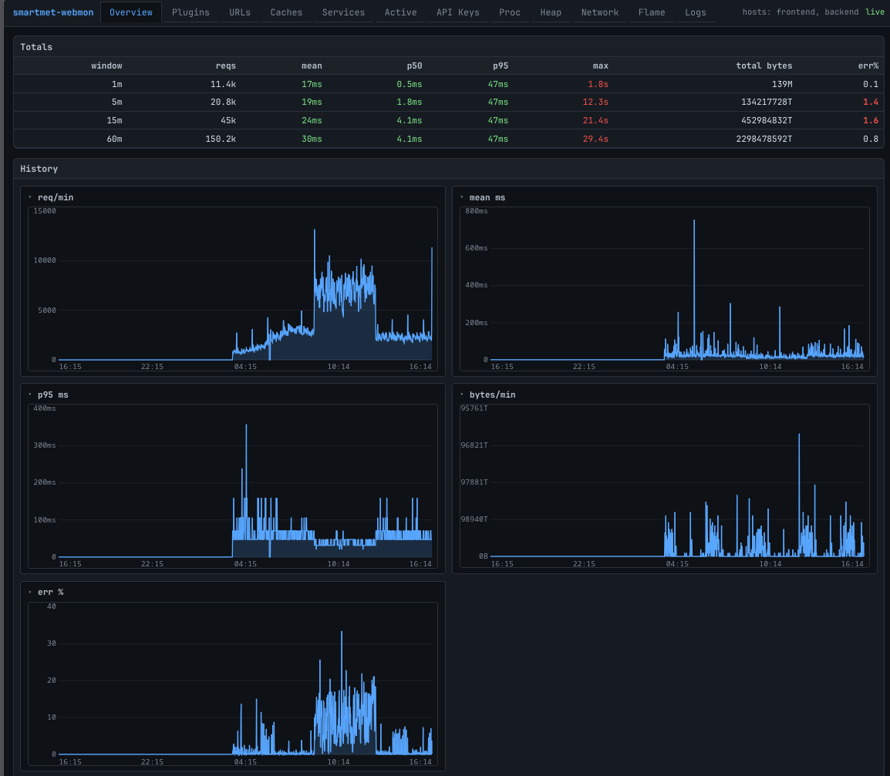

### Why a separate package

The data-collection layer (`smartmet_top.runtime`,
`smartmet_top.snapshots`, `smartmet_top.state.store`) lives in
`smartmet-monitor` and is reused by both binaries. The web-only
parts — the HTTP server, the static assets, the systemd unit — are
packaged separately as `smartmet-monitor-web` so sites that only
want the CLI tools don't pay for them. `smartmet-monitor-web`
requires `smartmet-monitor = %{version}-%{release}`, so the two
stay version-locked across upgrades; it also carries
`Obsoletes: smartmet-webmon` so installs of the previous package
name are replaced cleanly on `dnf upgrade`.

### How to run

The systemd unit is shipped **disabled by default**. On a typical
SmartMet host the unit needs no configuration: at startup `smwebmon`
auto-probes the standard frontend port (8080) and backend port (8081)
on localhost and registers whichever responds. Operators start it on
demand and tunnel into it with SSH:

```sh
sudo systemctl start smartmet-webmon            # on the SmartMet host
ssh -L 8765:localhost:8765 host                 # from your laptop
open http://localhost:8765/                     # any modern browser
sudo systemctl stop smartmet-webmon             # when done
```

The unit runs as user `smartmet-server` (the same user that owns
the `smartmetd` processes), which means two things work without any
extra configuration:

  * `perf record` — at the RHEL default `kernel.perf_event_paranoid=2`,
    profiling is only allowed for processes the calling user owns.
    Running smwebmon as the smartmetd-owner user makes the Flame
    panel work without dropping the kernel sysctl or granting
    capabilities.
  * `/var/log/smartmet/*-access-log` reads — these files are owned
    by the daemon writer, so same-user reads succeed without ACLs.

Override the user via a drop-in (`sudo systemctl edit smartmet-webmon`)
if your deployment uses a different operator account.

### Configuration

Options live in `/etc/sysconfig/smartmet-webmon` and are passed to
`smwebmon` via `EnvironmentFile=`. All settings are commented out by
default; uncomment and edit, then `sudo systemctl restart
smartmet-webmon` to apply.

| Flag                          | Default                | Notes                                               |
|-------------------------------|------------------------|-----------------------------------------------------|
| `--bind HOST:PORT`            | `127.0.0.1:8765`       | Loopback by default; the server is unauthenticated. |
| `-l, --log PATH-OR-GLOB`      | `/var/log/smartmet/*-access-log` | Repeatable.                                |
| `-u, --admin-url URL`         | *auto-probe localhost 8080 + 8081* | `LABEL=URL` form supported; repeatable / comma-list. Explicit `-u` suppresses the auto-probe. |
| `--no-admin`                  | off                    | Disable the localhost auto-probe (e.g. on a host that doesn't run SmartMet).|
| `-n, --admin-interval SEC`    | `2.0`                  | Same cadence as `smtop`.                            |
| `--replay`, `--include-rotated` | off                  | Populate the URLs panel from log history at start.  |
| `--history-minutes N`         | `1440` (24 h)          | Memory-bounded; see `smtop` README for sizing.      |
| `--journal-unit UNIT[,UNIT...]` | `smartmet-backend,smartmet-frontend` | Comma-separated; lines merge into one timestamp-ordered stream. Covers a host running either or both daemons. Empty string disables. |

The port `8765` is **only the default** — change it via `--bind` or
the sysconfig file. `smwebmon` deliberately does not enable `--perf`;
flame graphs are an interactive workflow that belongs to
`smtop --perf`, where the privilege requirement and CPU overhead
are immediately visible to the operator running it.

### Panels

The dashboard mirrors `smtop` panel-for-panel. Tab strip at the top;
the per-panel URL hash (`/#/<panel>`) is bookmarkable. Every chart is
rendered to HTML Canvas (no PNG round-trip, no external chart library)
and reuses the same color thresholds the curses view uses.

| Tab        | What it shows                                                                                                                   |
|------------|---------------------------------------------------------------------------------------------------------------------------------|
| Overview   | Totals table (1 / 5 / 15 / 60 min) plus 5 full-width line charts over the retained history (req/min, mean ms, p95 ms, bytes/min, err %). |
| Plugins    | One row per access-log source with two per-row sparklines (latency + size). Sortable, filterable, window 60s → 60m.             |
| URLs       | Per-URL latency / count / err table. Click a row → drill-down modal with windowed stats, 60-min latency line chart, latency-distribution histogram, status codes, top API keys. |
| Caches     | Per-cache row with hit-rate fill bar (color-coded) and hits/min trend sparkline. Size cell coloured by fill ratio.              |
| Services   | Per-handler row with req/min trend sparkline and the same `cpu%` color logic as the curses panel (green ≥ 50 % CPU-bound, blue ≤ 10 % wait-bound). |
| Active     | Top-of-panel in-flight count line chart + table of currently-active requests, sorted by duration.                              |
| API Keys   | Per-key row, sortable / filterable / windowed. Click a row → drill-down modal with windowed stats and the top URLs that key has hit. |
| Proc       | PID picker plus a section-card grid: memory (with VM RSS / anon / file / shmem and a Canvas RSS chart), I/O totals + read-rate chart, threads + fds + chart, major-page-fault rate chart. |
| Network    | TCP host-wide summary (retrans/s, listen overflow/drop with line chart), per-state count + trend sparkline, listen-socket table with recv-Q (highlighted when non-zero), per-NIC rx/tx Canvas charts. |
| Flame      | Interactive Canvas flame graph: click a rectangle to zoom in, click any breadcrumb segment to zoom out, hover for full function name + weight + %, search box highlights matching frames. Mode bar (on-cpu / off-cpu / off-cpu-locks / pagefault / wakeup / blockflame / malloc), thread-class filter (all / request / background), smartmet-only toggle. SmartMet:: frames are deterministically coloured in the orange/yellow band so they pop against glibc / kernel frames. Top-symbols table below the flame mirrors the curses list. |
| IP Flow    | Topological animation of access-log traffic. Two stacked timeline charts (req/min, bytes/min) span the retained history and act as the scrubber — click anywhere to pin the topology view to that minute. Topology canvas underneath places each client IP at a fixed angle on the rim (`angle = ip_int * 360 / 2**32`, so /24 neighbours sit at adjacent angles); each request becomes a circle that flies from its IP's slot to the centre over its `dur_ms`. Speed encodes latency, colour encodes status (green 2xx / blue 3xx / amber 4xx / red 5xx), radius encodes `log10(bytes)`. Hot-IP rim labels include the 2-letter country code when `--country-db` is set. Header: history depth, window length, top-N filter (10/25/50/100/all), Live, Pause. |
| Countries  | Per-country aggregate of access-log traffic. Multi-line chart at the top (one line per top-N country, plus an "other" series for the long tail) over the retained history, then a table ranking countries by request count with bytes / err % / distinct IPs / top IPs from that country. Empty-state when `--country-db` is unset. |
| Logs       | Live tail of the multi-source log ring with substring filter and autoscroll toggle.                                            |

The reading guide is unchanged from `smtop` — see the smtop section
above for healthy-shape / trouble-pattern / typical-root-cause /
where-to-look-next guidance, which applies as-written.

#### Screenshots

Plugins — one row per access-log source, latency + size sparklines, sortable / filterable / windowed:

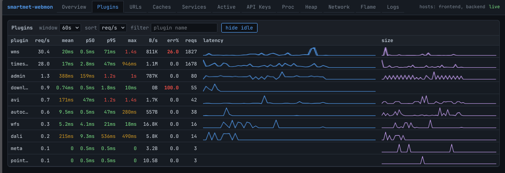

URLs — per-URL latency / count / err table; click a row for a drill-down modal:

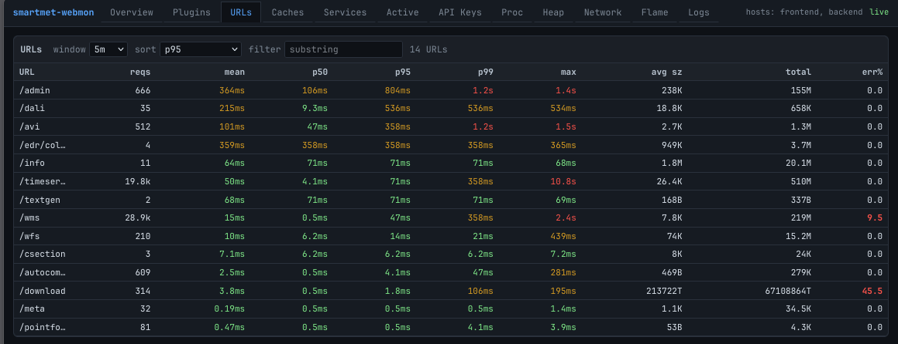

Caches — per-cache hit-rate bar (colour-coded) and hits/min trend sparkline:

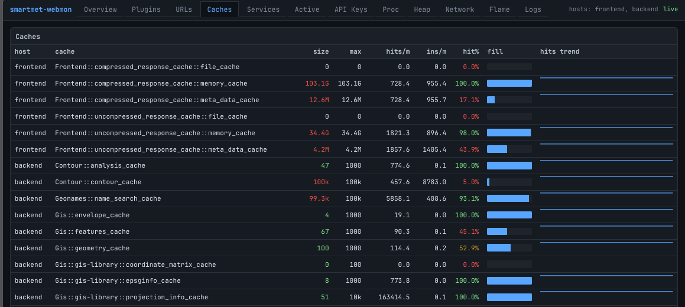

Services — per-handler row with req/min trend sparkline and `cpu%` colouring:

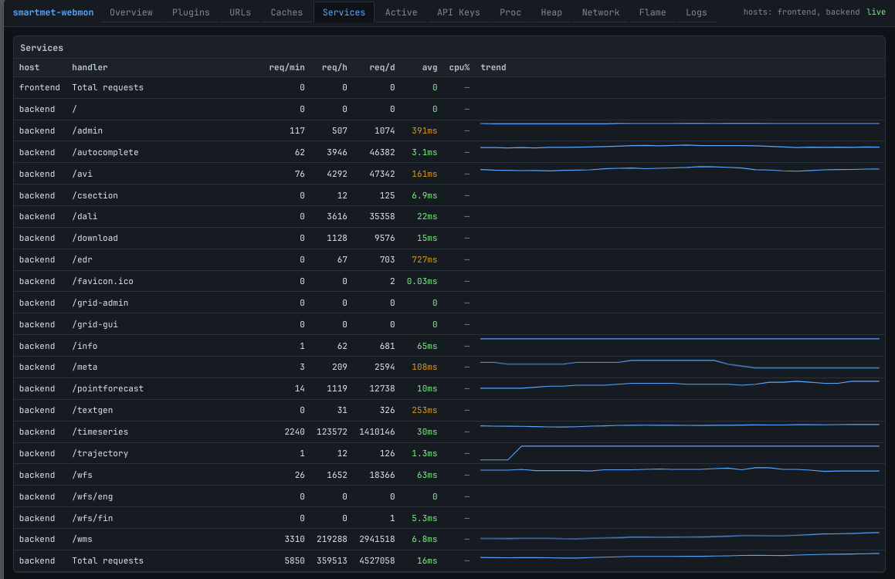

Active — in-flight count chart on top, table of currently-running requests below:

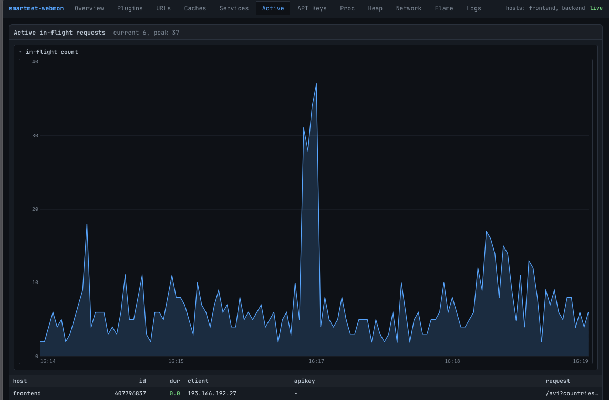

Proc — PID picker plus a card grid for memory, I/O, threads and major-page-faults:

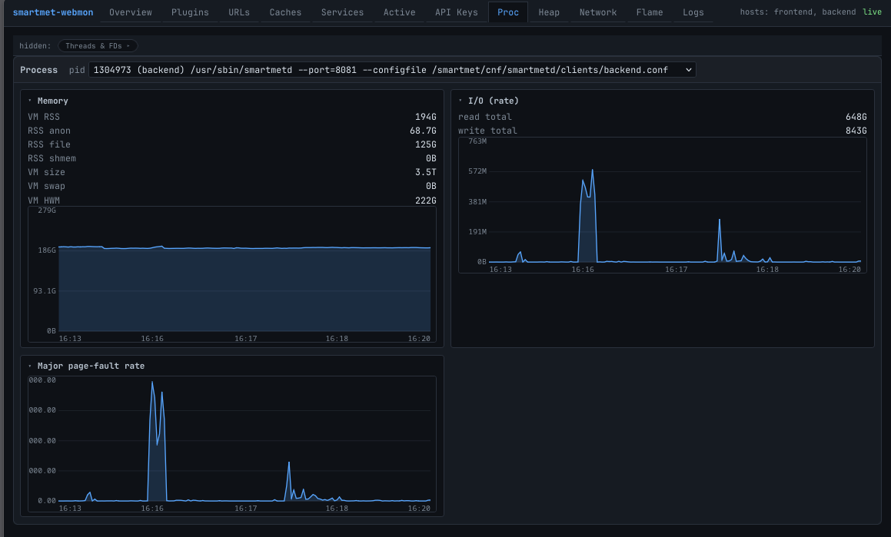

Network — TCP host summary, per-state counts, listen-socket table, per-NIC rx/tx charts:

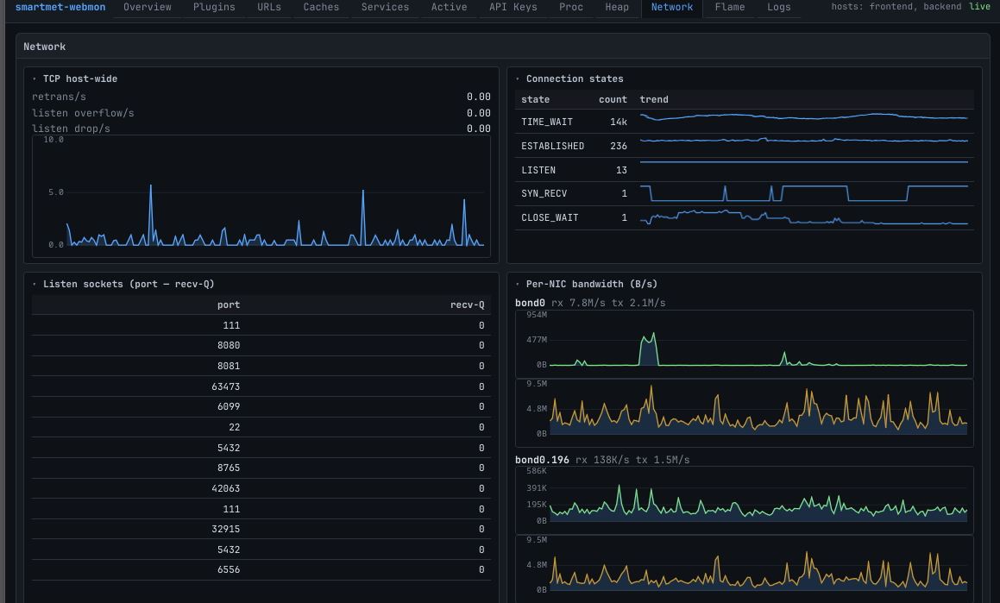

Logs — live tail of the multi-source log ring with substring filter and autoscroll toggle:

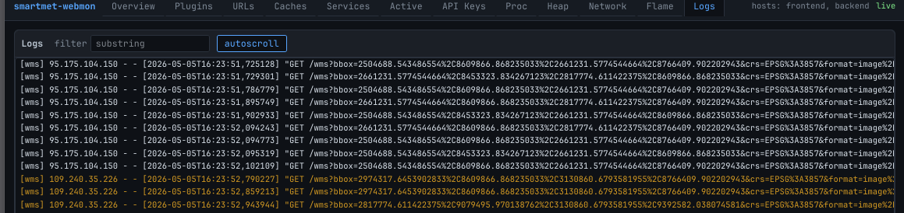

IP Flow — topological animation of access-log traffic.

The panel runs on a record-time **playhead** that walks forward at `speed × wallclock` and spawns each request as a particle when it crosses the request's timestamp. **Live** mode pins the playhead at the right edge of the timeline (newest data); each new request spawns immediately. **Replay 1h** / **Replay 24h** rewind the playhead and play history forward at the selected speed (default 60×, so 1 h plays in 1 min). **Click any point on either timeline chart** to pin the playhead there and start scrubbing forward from that minute. The cursor on each chart walks rightward visibly; speed and layout selectors live in the panel header.

**Encodings.** A small legend strip sits above the topology canvas: colour = HTTP status (green 2xx / blue 3xx / amber 4xx / red 5xx), particle speed ∝ 1/latency (slow particles took longer to serve), radius ∝ log10(bytes). Layout = numeric (`angle = ip_int * 360 / 2**32`, /24 neighbours cluster) or **spread** (rank-based, every IP gets equal arc — better for individual IP readability when traffic is highly concentrated). The top-12 IPs by request count get text labels at the rim; cold IPs still render particles at their correct angle but don't clutter the rim with ticks.

**Particle visibility floor.** At high replay speeds (300×, 1800×) a 100 ms request would otherwise traverse the radius in well under a millisecond. Particle visual lifetime is floored at 200 ms wallclock, so every request is at least perceptible; the speed-encodes-latency metaphor degrades gracefully toward "everything looks fast" at extreme speeds, which is the correct semantic.

**How to read it.** *Healthy shape:* a steady stream of green particles, with bursts clustered around one or two angles (the busy clients on this backend, e.g. AWS); particle radius mostly small; speed mostly fast. *Trouble pattern:* (a) a stream of red particles from one angle — one client driving an error path; (b) many slow particles from many angles — server-wide latency spike, look at Active and Proc; (c) a sudden change in dominant angle — a new heavy client arrived, cross-check with URLs and API Keys to see what it's requesting. *Typical root cause:* a hot single-IP red stream is usually a misconfigured client retrying a 5xx; a server-wide slowdown shows as the rim filling with slow particles regardless of angle. *Where to look next:* note the dominant angle, then jump to URLs (filtered to the busy time) to see which endpoints that client is hitting.

**Limitation.** The IP shown is whatever the access logger captured. On a backend behind a frontend cluster, that's the original client IP only if the backend is configured to log `X-Forwarded-For` (FMI's backends do); otherwise it's the frontend's own IP and the panel collapses to a small fan rather than the full circle.

Countries — per-country traffic aggregate.

**How to read it.** *Healthy shape:* the country mix on the chart matches your service's expected audience (FMI backends serve mostly Finland and Europe; you'd expect FI / SE / NO / DE / GB at the top, with the US appearing because of AWS-egress traffic from cloud-hosted clients). The "other" line stays small. *Trouble pattern:* (a) a single line spikes hard while others stay flat — one country is dominating, often a misbehaving client retrying; (b) the err % column is high for a specific country — that country's clients hit a path the server can't satisfy (geo-restricted endpoint, missing translation, regional CDN issue); (c) a previously-quiet country jumps into the top 5 — investigate, it's either a new legitimate user or the start of an abuse pattern. *Where to look next:* click the busy country's row to see the top IPs from that country, then jump to URLs filtered to that time window.

**Country-DB setup.** The Countries panel and the country labels on the IP Flow rim need a country database. The panel uses the daily delegated-stats files published by each RIR (no signup, no licence-attribution to thread through the UI). Manual setup:

```sh
sudo install -d /var/lib/smartmet-monitor
cd /var/lib/smartmet-monitor
for url in \
  https://ftp.apnic.net/stats/apnic/delegated-apnic-extended-latest \
  https://ftp.ripe.net/pub/stats/ripencc/delegated-ripencc-extended-latest \
  https://ftp.arin.net/pub/stats/arin/delegated-arin-extended-latest \
  https://ftp.lacnic.net/pub/stats/lacnic/delegated-lacnic-extended-latest \
  https://ftp.afrinic.net/pub/stats/afrinic/delegated-afrinic-extended-latest \
; do
  sudo curl -sS -o "$(basename "$url")" "$url"
done
sudo systemctl restart smartmet-webmon
```

`smwebmon` searches `/var/lib/smartmet-monitor/` first, then `/tmp/smartmet-rir/` (handy for dev), then nothing. Override with `--country-db PATH` (file or directory). The files together are ~45 MB and load in under a second; ~325 k netblocks resolve via bisect at lookup time.

**Privacy note.** Country granularity is intentional. City-level lookup would identify users; country-level adds operational value (capacity planning, abuse detection) without escalating what the dashboard already retains.

Flame — interactive Canvas flame graph with five recording modes; SmartMet:: frames are coloured in the orange/yellow band so they pop against glibc / kernel frames.

On-CPU (default, 99 Hz `perf record`) — where the CPU is going:

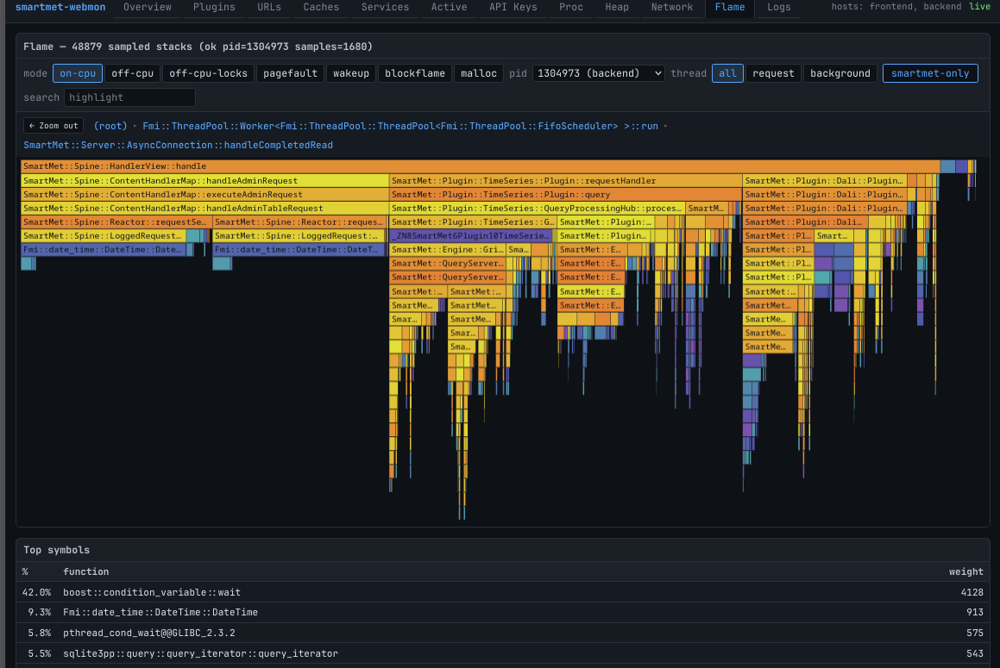

Off-CPU (`offcputime-bpfcc`, weighted by µs blocked) — where threads are stuck:

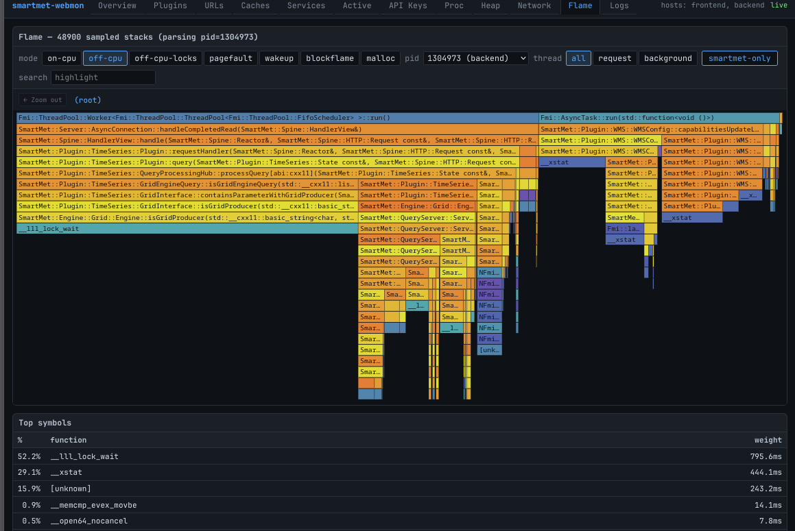

Page-fault (`perf record -e major-faults`) — where smartmetd hits cold pages:

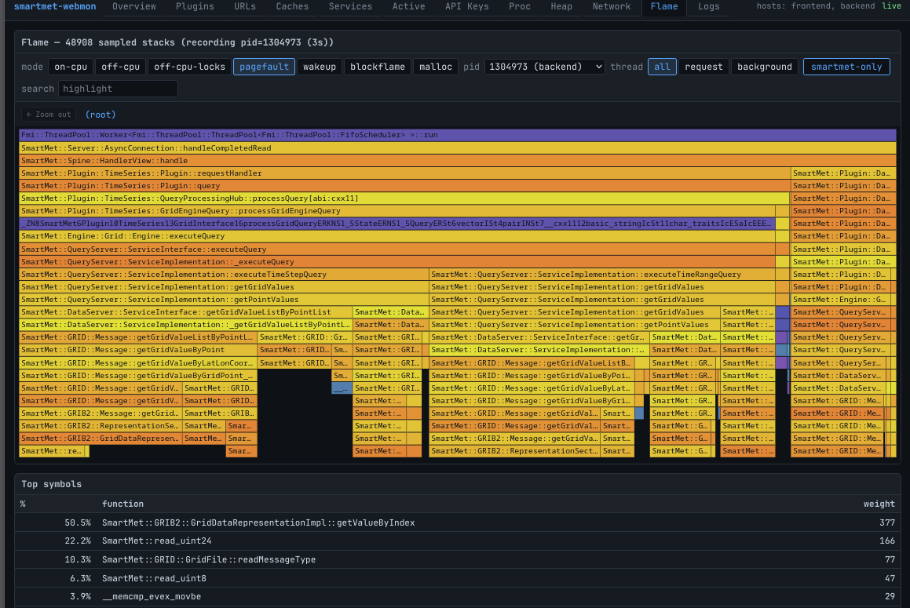

Wakeup (`perf record -e sched:sched_wakeup`) — the dual of off-CPU, the other side of a contention pair:

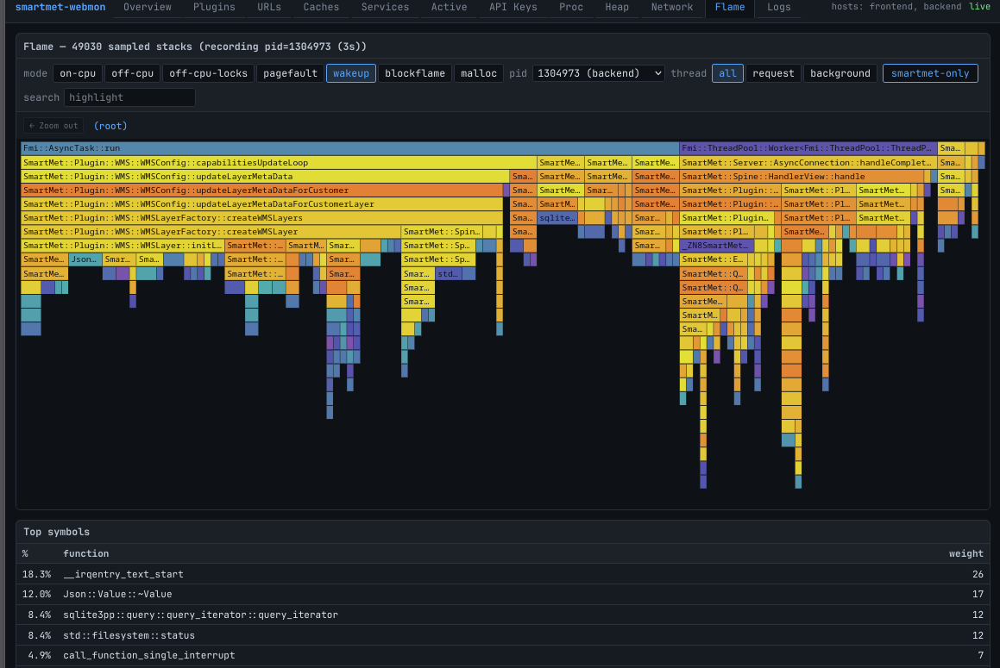

Block-I/O issue (`perf record -e block:block_rq_issue`) — every block-layer request the PID issued:

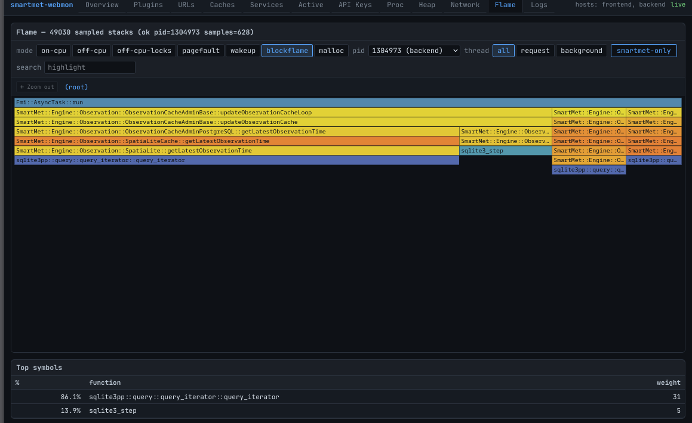

### Cluster mode

`smwebmon` running on a SmartMet **frontend** can monitor every
backend the frontend routes to in one dashboard, without the operator
having to SSH-tunnel into each backend separately. Auto-detected on
startup: if the local SmartMet daemon's `?what=clusterinfo` output
self-identifies as `FRONTEND`, the cluster is registered with one
polling task per alive backend (`c1`, `c2`, …, `v1.q3`, …), each
admin URL constructed as `http://{prefix}.<local-domain>:8081/admin`.

Multi-cluster setups (e.g. an FMI host that fronts both the `back`
and `internal` clusters via different prefix families) live in
`/etc/smartmet-webmon/clusters.conf`:

```ini
[back]
frontend-url      = http://smartmet.fmi.fi
admin-url-pattern = http://{prefix}.back.smartmet.fmi.fi:8081/admin

[internal]
frontend-url      = http://internal.smartmet.fmi.fi
admin-url-pattern = http://{prefix}.back.smartmet.fmi.fi:8081/admin
```

A dropdown next to the brand in the top bar switches between
clusters; the URL hash includes the active cluster
(`#/cluster=back/urls`) so per-cluster bookmarks survive reloads.

#### Topology strip

Below the top bar, in cluster mode only: one rounded pill per
backend prefix, with a color-hashed dot identifying that backend
across every chart legend in the dashboard (so `c2`'s line on the
URL chart and its dot on the topology strip are the same color).
The number to the right of each prefix is the backend's handler
count from the most recent `clusterinfo` snapshot; hover any pill
to see the full handler list. A backend with no body in
`clusterinfo` (registered prefix, no handlers) is rendered as
muted with a strikethrough — that's the frontend's signal that
the backend is offline / draining / paused.

The discovery loop refreshes the topology every 60 s by default;
the strip's render is debounced on a content hash so the
operator's mid-hover position isn't lost on idle refreshes.

**Healthy shape:** every pill colored, handler counts roughly
equal across backends in the same family (a 6-backend timeseries
cluster should show ~the same handler list on every member;
a single backend with markedly fewer handlers is a config drift
signal).

**Trouble pattern:** one pill greyed-out and struck through →
that backend dropped out of routing. Two pills greyed within
seconds of each other → the frontend lost connectivity to a
sub-rack, not random failure. All pills greyed → the frontend
itself is failing to reach any backend, check the frontend's
own logs and Sputnik state.

**Where to look next:** Active panel for in-flight count
(does the cluster's load shift to surviving backends?), Logs
panel for the frontend's view of the failure.

#### Per-backend overlays in every chart

In cluster mode, every panel that produces a time-series chart in
single-host mode renders one line per backend instead of one
aggregated line. The lines share the color hash with the topology
strip, so identifying which backend is misbehaving is a glance
operation.

Where the data comes from is panel-dependent and worth knowing:

| Panel              | Data path                                                                                        | HTTP cost per refresh |
|--------------------|--------------------------------------------------------------------------------------------------|-----------------------|
| Active             | per-host buffers in `store.active_count_history` already collected by the 2 s admin polling      | 0 extra fetches       |
| Caches / Services  | per-host `store.cache_history` / `store.service_history` from the 2 s admin polling              | 0 extra fetches       |
| URLs / Plugins / Keys / Overview | parallel on-demand `?what=lastrequests&minutes=N` from each backend at chart-refresh time | N (one per alive backend, in parallel) |
| **Proc** (cluster) | parallel on-demand fetch of each backend's own `<webmon>/api/proc/detail` (requires `smwebmon` running on each backend; configured via `webmon-url-pattern` in `clusters.conf`) | N (one per Proc-capable backend, in parallel) |

The on-demand-parallel pattern is used where per-host attribution
is not retained in the store: `_ingest_lastrequests` aggregates
URL / plugin / apikey rows into the cluster store so the table
views can rank across the whole cluster, but the per-host shape
needed by the multi-line chart has to be re-derived. Wall time
for the on-demand fetch is approximately the slowest backend's
response time (the requests run concurrently in a thread pool),
typically under 1 s for a six-backend cluster.

#### Cluster Proc panel — backend smwebmon required

`/proc` data (RSS, IO, threads, page-faults) is per-host kernel
state, not exposed by the SmartMet admin plugin. The dashboard's
cluster Proc panel sources it by **fanning out to each backend's
own `smwebmon`**: when `webmon-url-pattern` is set in
`clusters.conf`, the cluster discovery loop probes each backend's
`smwebmon` at `/api/health` on every cycle, and the cluster Proc
panel calls each Proc-capable backend's `/api/proc/detail` in
parallel at refresh time.

Setup:

1. Install `smartmet-monitor-web` on every backend (the same RPM
   the frontend already has). Each backend's `smwebmon` reports its
   local kernel's view, no admin plugin extension needed.
2. Bind the backend's `smwebmon` to a routable address. The
   default is loopback-only, which the frontend cannot reach.
   Edit `/etc/sysconfig/smartmet-webmon` on each backend:
   ```sh
   OPTS="--bind=0.0.0.0:8765"
   # or: OPTS="--bind=10.0.0.42:8765"   (the backend's internal IP)
   ```
   Then `systemctl restart smartmet-webmon`. **Restrict access
   at the firewall** — `smwebmon` is unauthenticated; only the
   cluster's frontend(s) should reach a backend's port 8765.
3. Add `webmon-url-pattern` to the cluster's `clusters.conf`
   section:
   ```ini
   [back]
   frontend-url       = http://smartmet.fmi.fi
   admin-url-pattern  = http://{prefix}.back.smartmet.fmi.fi:8081/admin
   webmon-url-pattern = http://{prefix}.back.smartmet.fmi.fi:8765
   ```
   Restart the frontend's `smwebmon`. Backends that respond to
   `/api/health` flip from `webmon_ok=False` to `True` on the next
   discovery cycle (default 60 s).

The cluster discovery status reflects this in the cluster
selector dropdown: e.g. `back (5/6 alive, 4 with smwebmon)`.

The Proc panel detects cluster mode via the active cluster
selector and renders four per-backend overlay cards: **Memory
(RSS)**, **I/O read rate** + **I/O write rate**, **Threads**,
**Major page-fault rate**. Each card carries one line per
Proc-capable backend, color-hashed the same way as every other
cluster panel — c2 is the same color on the URL chart, the
topology pill, the Active chart, and now the cluster Memory
chart. Click a backend's legend entry to hide its line and let
the others scale up.

Backends that respond on admin but not on `smwebmon` (typical
when `smwebmon` is not yet enabled across the cluster) are
listed at the bottom of the panel as
`unreachable backends: c5 (unreachable: ...)`. They participate
in every other cluster panel — only the Proc overlay needs
cross-host kernel access.

**Reading a multi-line chart**

* **Healthy shape:** all visible lines roughly track each other
  (a frontend-balanced cluster spreads load evenly), and the
  per-backend tooltip values are within a 2× spread of each
  other at any given minute.
* **Trouble pattern:** one line consistently above the others
  → that backend is slower / hotter than its peers (single-host
  troubleshooting on that node from there: `top`, perf, qengine).
  One line at zero with the rest active → that backend isn't
  receiving traffic (Sputnik routing issue or backend down).
  All lines spike together → cluster-wide event (upstream issue
  or shared dependency like the database).
* **Typical root cause:** a hot backend is usually disk-I/O bound
  (qengine producer cache miss or stale querydata); a cold
  backend is usually a routing or health-check issue at the
  frontend.
* **Where to look next:** click into the URL / plugin / apikey
  the chart was filtered to, then check the backend-specific
  Plugins / Caches / Services panels for per-handler breakdown
  on the offending backend.

The legend below each multi-line chart is clickable: clicking a
backend's label hides that line so the rest scale to fill the
chart. The hover tooltip lists every visible backend's value at
the cursor's minute, sorted descending so the busiest backend
is at the top. The tooltip's vertical position is pinned to the
canvas's top edge — only X tracks the cursor — so the box does
not bounce as the cursor crosses peaks and valleys in a busy
chart.

### Costs and policy

The cost analysis (~80–150 MB RSS, ~5 % of one core, ~43 200 admin
requests/day at 2 s polling) was judged small but not free, which
is why the unit ships disabled. The unit also installs defensive
cgroup rails (`MemoryMax=512M`, `CPUQuota=200%`) so a future bug
cannot eat the host. Override these via a drop-in if your host
warrants it:

```sh
sudo systemctl edit smartmet-webmon
```

### Enabling the flame-graph modes

The Flame panel's modes (on-CPU, off-CPU, page-fault, wakeup,
block-I/O) and the Proc panel's perfstat numbers need access to
hardware perf events and kernel tracepoints, which the RHEL default
`kernel.perf_event_paranoid=2` denies to non-root users. Two ways to
enable them:

  * **Lower the sysctl** (broadest, simplest):
    ```sh
    echo 'kernel.perf_event_paranoid = 0' | \
        sudo tee /etc/sysctl.d/99-smartmet-perf.conf
    sudo sysctl --system
    sudo systemctl restart smartmet-webmon
    ```
  * **Grant the unit `CAP_SYS_ADMIN`** via `sudo systemctl edit
    smartmet-webmon` (more surgical, doesn't change the system-wide
    paranoid level).

For bcc-tools modes (off-CPU, biolat, runqlat) you also need the
`kheaders` kernel module pre-loaded:

```sh
echo "kheaders" | sudo tee /etc/modules-load.d/kheaders.conf
sudo modprobe kheaders
```

Full reasoning, per-feature compatibility table, and security
trade-offs are in [`doc/perf-event-paranoid.md`](doc/perf-event-paranoid.md)
(installed as `/usr/share/doc/smartmet-monitor/perf-event-paranoid.md`).

### What's NOT in v1 (deferred to follow-ups)

  * Server-Sent Events for live updates — current page polls the
    active panel every 2 s with `fetch()`. SSE replacing the polling
    loop is the next planned step.
  * Authentication — localhost-only with SSH tunnelling is the
    deliberate v1 model. Token auth lands when there is a concrete
    multi-user use case.

## Building the RPM

```sh
make rpm                # builds both RPMs from smartmet-monitor.spec
make rpms               # historic alias for `make rpm`
```

`make rpm` builds a source tarball from `HEAD`, stages it under
`%_sourcedir` (from `~/.rpmmacros` — the same convention as the
other `smartmet-*` packages in this workspace), and runs
`rpmbuild -bb smartmet-monitor.spec`. The single spec produces two
RPMs: the main `smartmet-monitor` package and the optional
`smartmet-monitor-web` subpackage; the subpackage pins
`Requires: smartmet-monitor = %{version}-%{release}` so the pair
stays in lockstep, and carries `Obsoletes: smartmet-webmon` so any
host already running the previous package name is upgraded cleanly.

The resulting `smartmet-monitor-<version>-<release>.noarch.rpm` installs
everything under `/usr/bin`, `/usr/share/smartmet`, and the distribution
site-packages directory (e.g. `/usr/lib/python3.9/site-packages/smartmet_top`).
The companion `smartmet-monitor-web-<version>-<release>.noarch.rpm` adds
`/usr/bin/smwebmon`, `/usr/share/smartmet/webmon/`,
`/usr/lib/systemd/system/smartmet-webmon.service`,
`/etc/sysconfig/smartmet-webmon`, and the `smartmet_webmon` Python
package next to `smartmet_top`.
