# smartmet-monitor

Log analysis and live monitoring tools for SmartMet Server. Ships two
complementary command-line programs:

| Command                          | What it does                                                         |
|----------------------------------|----------------------------------------------------------------------|
| `bstat`, `bchart`, `burls`, `bstatus`, `bkeys` | Offline analysis of access-log files (Bash + gawk). |
| `smtop`                          | Interactive curses dashboard that tails logs and polls `/admin`.     |

Both parts are implemented against the Python 3 and GNU Awk 5 standard
libraries. No third-party runtime dependencies are required.

## Installation

```sh
make install                  # installs under /usr/{bin,share,lib/pythonX}/
make rpm                      # builds an RPM under ./rpmbuild/RPMS/noarch/
```

The RPM package name is `smartmet-monitor`. It requires Python 3.9
(the `python3` package on RHEL 10 / Fedora, or the `python39`
AppStream module on RHEL 8) plus `gawk`.

On a fresh builder, install the build dependencies straight from the
spec before running `make rpm`:

```sh
sudo yum-builddep smartmet-monitor.spec     # RHEL 8
sudo dnf builddep smartmet-monitor.spec     # RHEL 10 / Fedora
```

## `bstat` family — offline log analysis

Each tool accepts a log file path (or reads stdin) and writes a
Unicode-block summary to the terminal. Click a command name to jump
to its section:

| Command | Synopsis |
|---------|----------|
| [`bstat`](#bstat--bucketed-dashboard)                              | `[-i INTERVAL] [-w WIDTH] [-H HEIGHT] [--ascii] [LOG]` |
| [`bchart`](#bchart--single-metric-vertical-chart)                  | `[-i INTERVAL] [-m reqs\|ms\|kb\|mb\|err] [-H HEIGHT] [-w CELLW] [--ascii] [LOG]` |
| [`burls`](#burls--top-urls-with-query-string-filtering)            | `[-n N] [-s reqs\|ms\|kb\|mb] [-d\|-k LIST] [-L\|-i] [LOG]` |
| [`bstatus`](#bstatus--http-status-code-distribution)               | `[-i INTERVAL] [-H HEIGHT] [--ascii] [LOG]` |
| [`bkeys`](#bkeys--top-api-keys)                                    | `[-n N] [-s reqs\|ms\|mb] [LOG]` |

`INTERVAL` is one of `1s | 10s | 1m | 2m | 5m | 10m | 1h | 1d`.
Most intervals snap to a digit boundary, so they are extracted by
truncating the ISO-8601 timestamp; `2m` and `5m` use minute-rounding
instead. `-H HEIGHT` sets the Braille chart height (in character rows)
consistently for `bstat`, `bchart`, and `bstatus` — defaults to `4`
for the sparkline footer in bstat / bstatus and `12` for bchart.

Default log path: anything matching `/var/log/smartmet/*-access-log` if
you omit the argument on a SmartMet host.

### `bstat` — bucketed dashboard

```sh
bstat -i 1h          wms-access-log         # default sparkline height (4)
bstat -i 1h -H 1     wms-access-log         # compact, single-row sparklines
bstat -i 1h -H 5     wms-access-log         # taller multi-row sparklines
```

Per-row half-height bars for requests / latency / size / bandwidth,
with multi-row Braille sparklines underneath that show each metric
as a time series. `-H` tunes the sparkline height: `-H 1` collapses
to a single dot-ramp row that fits short terminals, while higher
values give 4 dot rows of vertical resolution per char-row.

Compact form (`-H 1`):

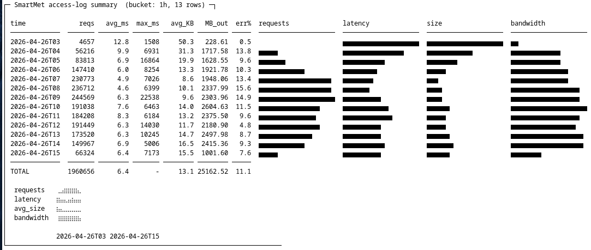

Taller form (`-H 5`) on the same data — the sparkline shape becomes
much easier to read:

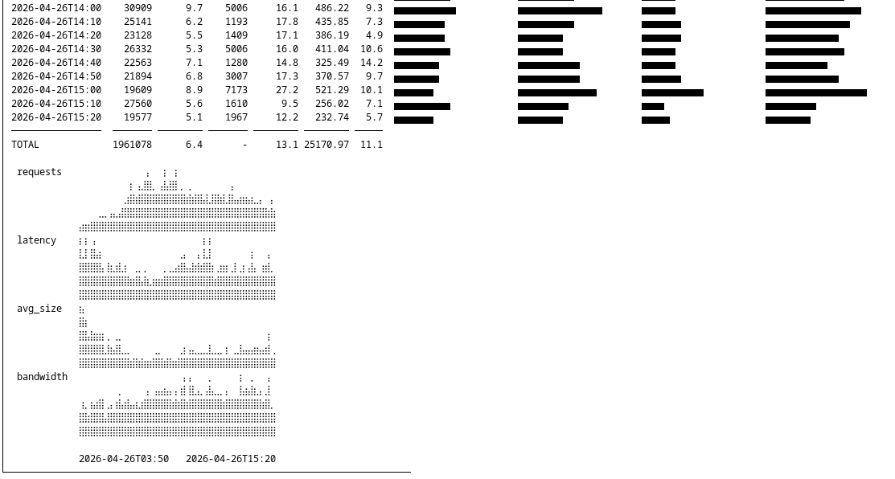

### `bchart` — single-metric vertical chart

```sh
bchart -i 10m -m reqs    wms-access-log
bchart -i 10m -m ms      timeseries-access-log
```

Braille vertical chart, two buckets per character cell, levels 0-4
per char-row. Latency varies more than request count and shows the
encoding's vertical resolution:

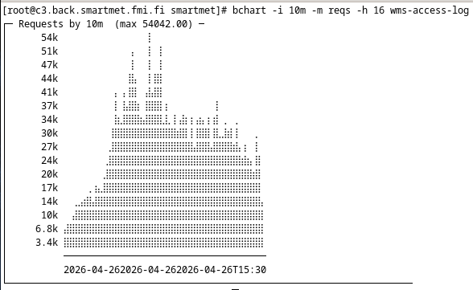
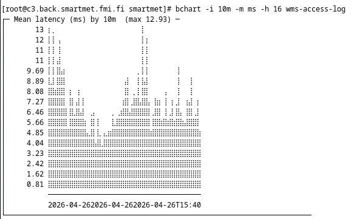

### `burls` — top URLs with query-string filtering

```sh
burls -L wms-access-log                       # discover query params
burls    wms-access-log                       # full URL grouping
burls -d bbox,time wms-access-log             # collapse noisy params
burls -i wms-access-log                       # interactive: list, prompt, run
```

Per-service access logs share a path prefix (`/wms`, `/timeseries`
…), so the query string is what distinguishes traffic. By default
`burls` groups on the full URL — different parameter sets become
separate rows. `-L` prints a frequency table of every distinct
parameter name in the log; pick noisy ones (typically `bbox`,
`time`, `latlon`) and pass them via `-d` to collapse otherwise
identical entries. `-i` runs `-L`, prompts for a comma-separated
drop-list on stdin, and re-runs the analysis with that filter.

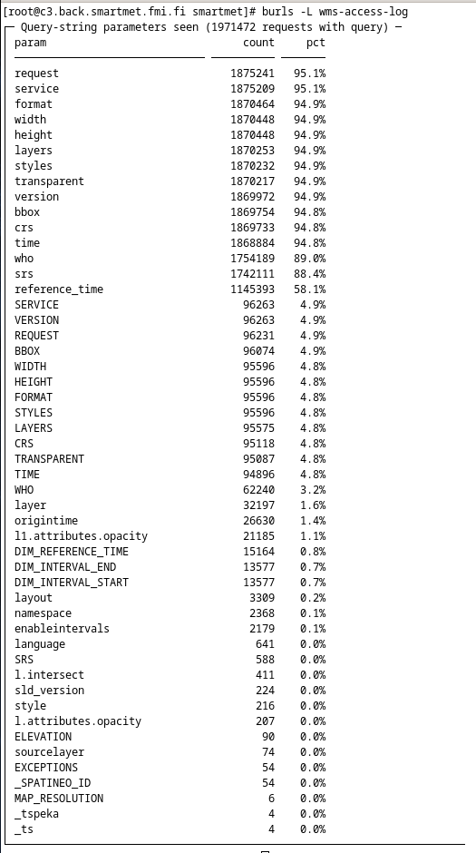
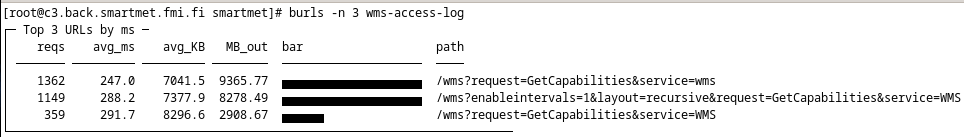

### `bstatus` — HTTP status code distribution

```sh
bstatus -i 1h wms-access-log
```

Aggregate code distribution + per-class breakdown. With `-i`,
prepends a per-class Braille sparkline showing how each class
(2xx / 3xx / 4xx / 5xx) moved over time:

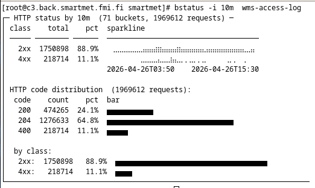

### `bkeys` — top API keys

```sh
bkeys -n 20    wms-access-log              # top 20 by request count
bkeys -n 20 -s ms  wms-access-log          # top 20 by total time spent
bkeys -n 20 -s mb  wms-access-log          # top 20 by bandwidth
```

Per-API-key aggregate stats (request count, mean latency, total
megabytes) with a horizontal half-height bar scaled to the top
key. Sort key chosen with `-s`.

### Legacy compatibility aliases

The package also installs six compatibility commands that pin the
bucket size. These exist so operator muscle memory and older scripts
continue to work during a gradual rollout:

| Alias       | Equivalent        |
|-------------|-------------------|
| `bstat1s`   | `bstat -i 1s`     |
| `bstat10s`  | `bstat -i 10s`    |
| `bstat1`    | `bstat -i 1m`     |
| `bstat10`   | `bstat -i 10m`    |
| `bstat60`   | `bstat -i 1h`     |
| `bstat24`   | `bstat -i 1d`     |

All six forward their arguments to `bstat`, so you can still pass
`--ascii` / `-w` / `-H` / a log file path. New scripts should prefer
the `bstat -i X` form directly.

### `--ascii` mode

Pass `--ascii` to `bstat`, `bchart`, or `bstatus` to render with
plain ASCII (`=` bars, `. : | #` sparkline ramp) instead of
half-height Unicode and Braille. The sparkline footer collapses to
a single dot-ramp row regardless of `-H`. Useful for scripts that
grep the output, or for terminals without reliable UTF-8 support.

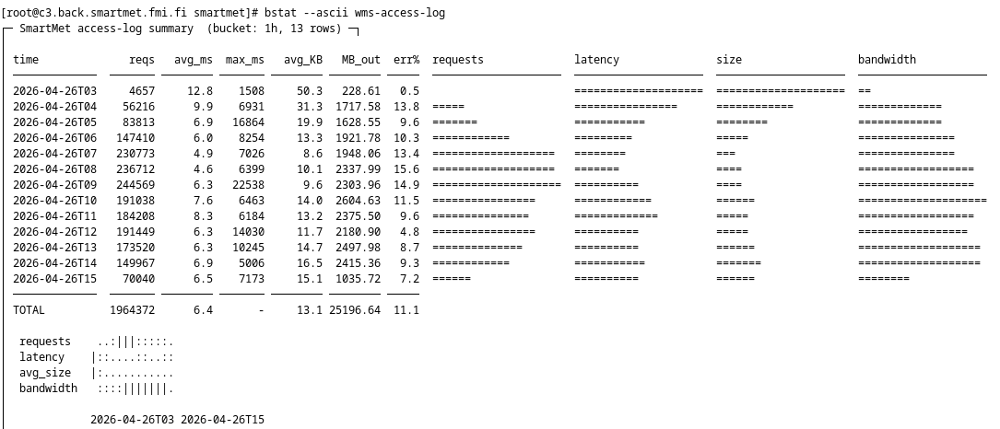

The tools parse the SmartMet access-log format produced by
`spine/AccessLogger.cpp`:

```
IP - - [END_TIME] "METHOD URL HTTP/VER" STATUS [START_TIME] DUR_MS BYTES "ETAG" APIKEY
```

All five commands share `/usr/share/smartmet/bstat.sh` as a library; set
`SMARTMET_MONITOR_LIB=/path/to/bstat.sh` to point at a different one
(used when running from a source checkout).

## `smtop` — live dashboard

```sh
smtop [-l PATH-OR-GLOB ...] [-u LABEL=URL,URL ...] [-n SECONDS] \
      [--replay] [--replay-bytes N] [--include-rotated] \
      [--history-minutes N] [--ascii] [--perf] [--perf-interval SEC]
```

A typical production invocation, used for every screenshot below:

```sh
smtop --perf --replay -u http://127.0.0.1:8081/admin
```

`--perf` enables the live flamegraph and perf-top symbol view (requires
`perf` from `linux-tools` plus root or `kernel.perf_event_paranoid <= 2`),
`--replay` populates the panels from the tail of every
`/var/log/smartmet/*-access-log` on startup, and `-u` points at the
SmartMet admin plugin for the polled cache/service/active-request data.

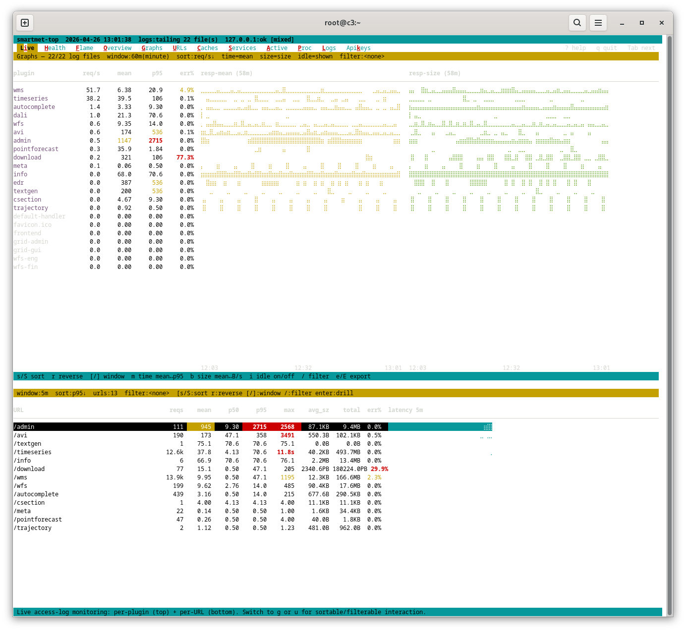

Each panel has one **red highlighted letter** in its tab label — pressing
that letter (case-insensitive) jumps directly to it; `Tab`/`Shift-Tab`
cycle through panels. Sparklines and charts use Braille (U+2800..U+28FF)
for 2× horizontal density and 4× vertical resolution; pass `--ascii` to
fall back to eighth-block characters on terminals that don't render
Braille well.

**Composite views** (multiple panels visible at once — the long-term
direction; the dedicated single-panel views below remain for sortable
/ filterable interaction):

1. l**i**ve — Graphs panel (per-plugin live, top 60%) + URLs panel
   (bottom 40%). The default startup view when log files are
   configured. Operator goal: "which plugin is busy and which URLs
   inside it are slow?"

   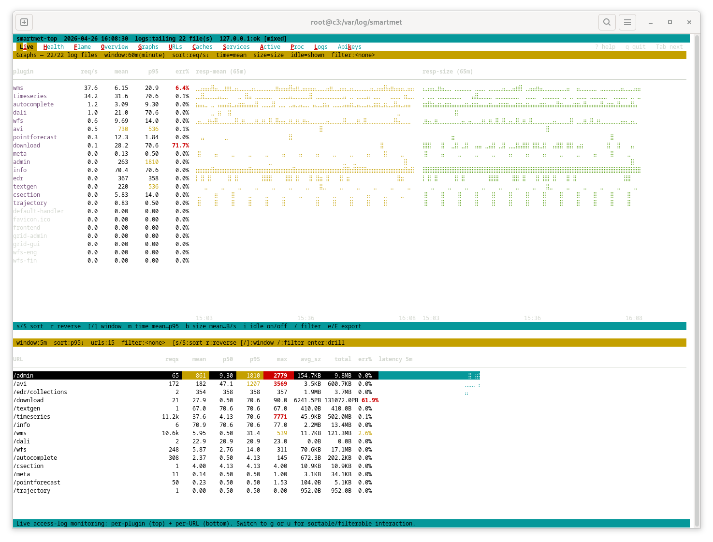

2. **h**ealth — Caches (top), Services (middle), Active in-flight
   (bottom), in equal thirds. Operator goal: "is this server healthy?"
3. **f**lame — full-screen live flamegraph for the focused
   `smartmetd` PID. Requires `--perf`. Rebuilds every perf cycle from
   the entire retained stack ring (~20 000 samples). Cursor keys
   navigate the tree, Enter zooms into the selected frame, Esc / `u`
   zooms out, `0` / Home resets to the root. `s` opens a preset
   menu (1 / 3 / 5 / 10 / 20 / 30 s) for the per-cycle record
   duration; the new value takes effect on the next cycle without
   restarting smtop. The lower portion of the screen carries the
   perf-top symbol list so nothing is wasted on shallow stacks.

   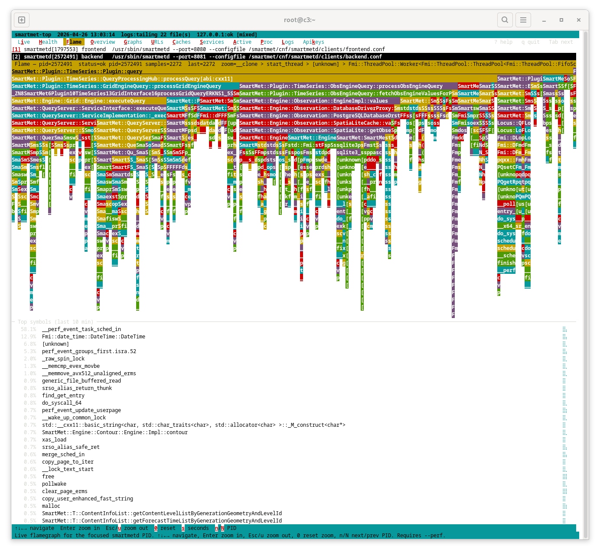

**Single-panel views**:

4. **O**verview — totals (1m/5m/60m) plus four mini-charts
   (requests/min, mean ms, MB/min, error %) and a full-width
   request-rate sparkline.
5. **G**raphs — live per-plugin access-log monitor. One row per
   `*-access-log` file with req/s, mean/p95 latency, error %, and two
   independently auto-scaling Braille sparklines (response time +
   response size) over the last 60 seconds at 1-second resolution.
   `m` toggles time spark mean ↔ p95, `b` toggles size spark
   mean ↔ throughput, `i` shows/hides idle handlers.

   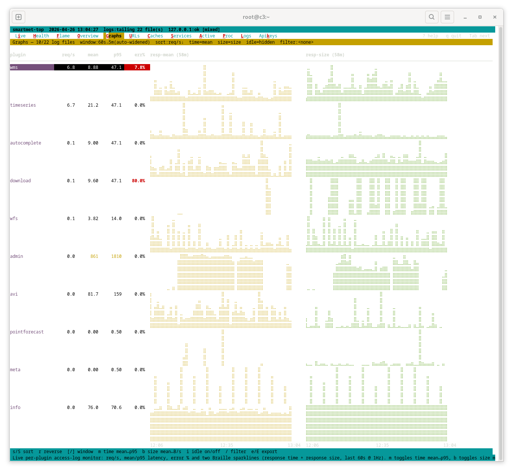
6. **U**RLs — live, sortable table with p50/p95/max latency, mean size,
   error %, and a per-URL latency sparkline. Press Enter to drill into
   a URL: windowed stats, 60-minute mean-latency sparkline, exponential
   histogram, status-code breakdown, and top API keys using that URL.
   ↑/↓ walk through URLs without leaving the drill-in.

   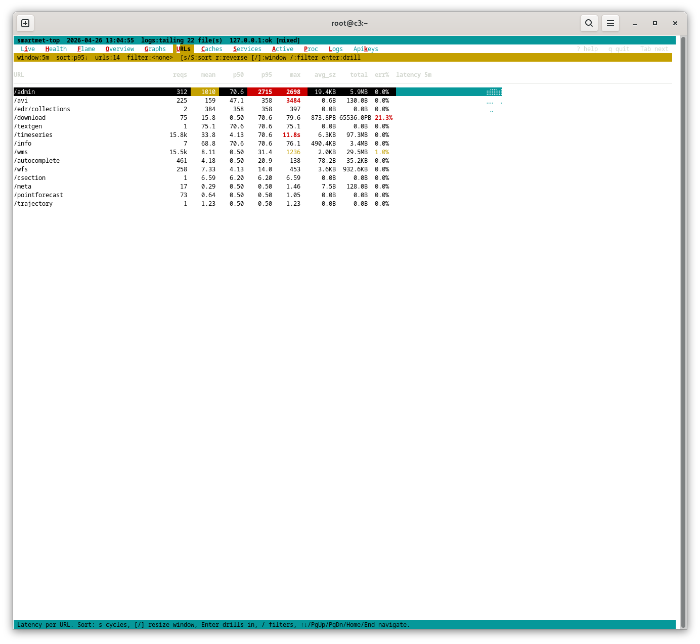

7. **C**aches — per-cache size / hit rate / hits-per-minute bars plus
   a trend sparkline (from polled history).

   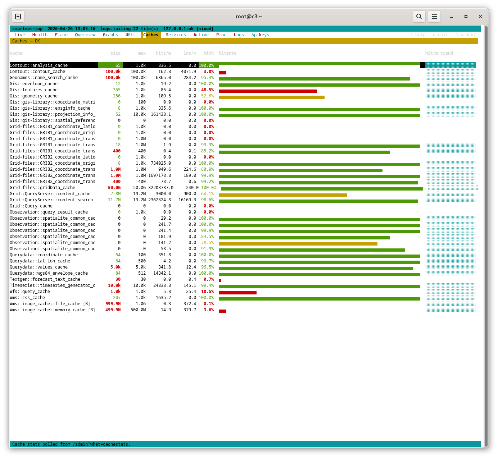

8. **S**ervices — per-handler request rate + trend sparkline.

   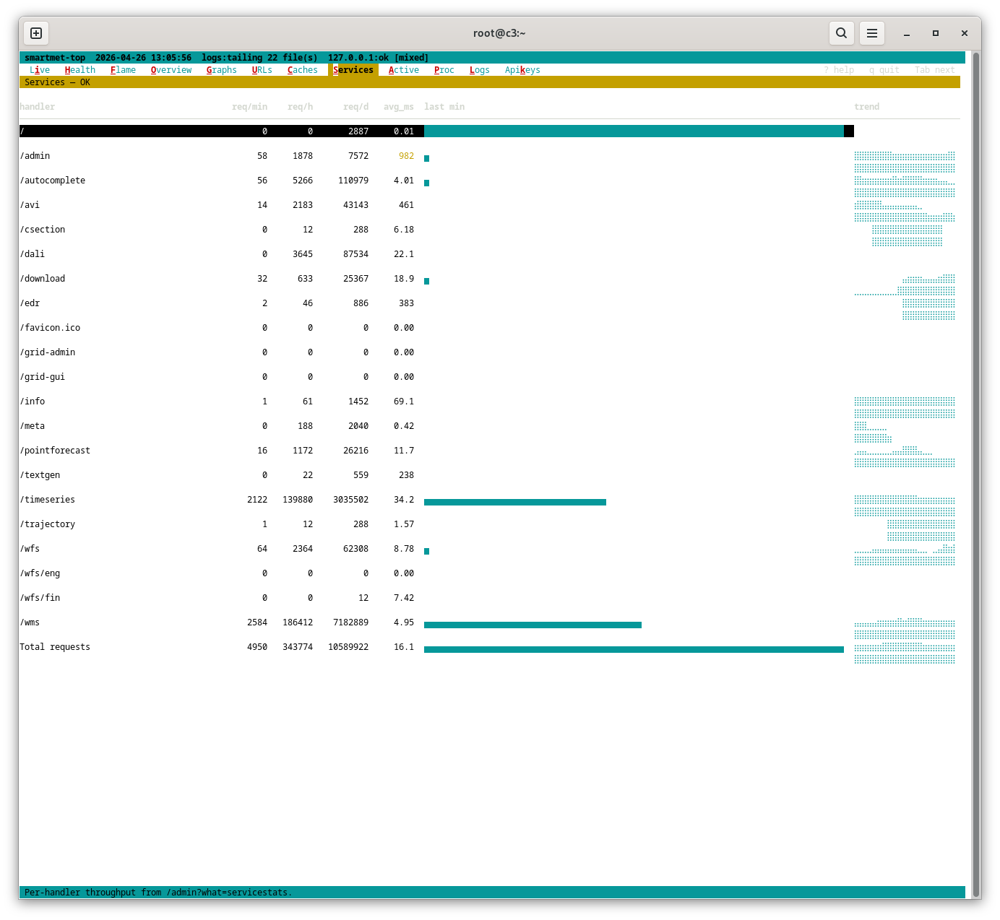

9. **A**ctive — in-flight requests sorted by descending duration. The
   Braille sparkline at the top tracks the in-flight count over the
   recent admin-poll history.

   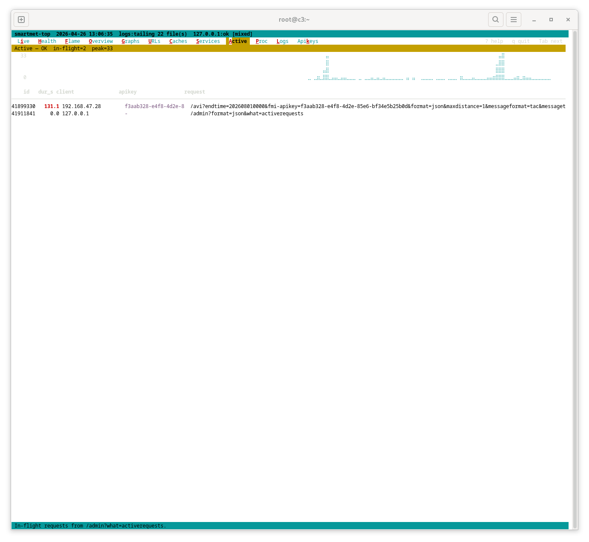

10. **P**roc — `/proc`-based memory + I/O for each `smartmetd` process
   on the host, with RSS-split sparklines (file-backed vs anon vs
   shmem), `VmPTE`, swap, FDs, and on-demand `smaps_rollup`. Multiple
   smartmetd PIDs (frontend + backend) are switched via `n`/`N`. With
   `--perf`, the panel adds a live perf-top symbol view and a Braille
   flamegraph that updates each cycle (`f` toggles between them).

   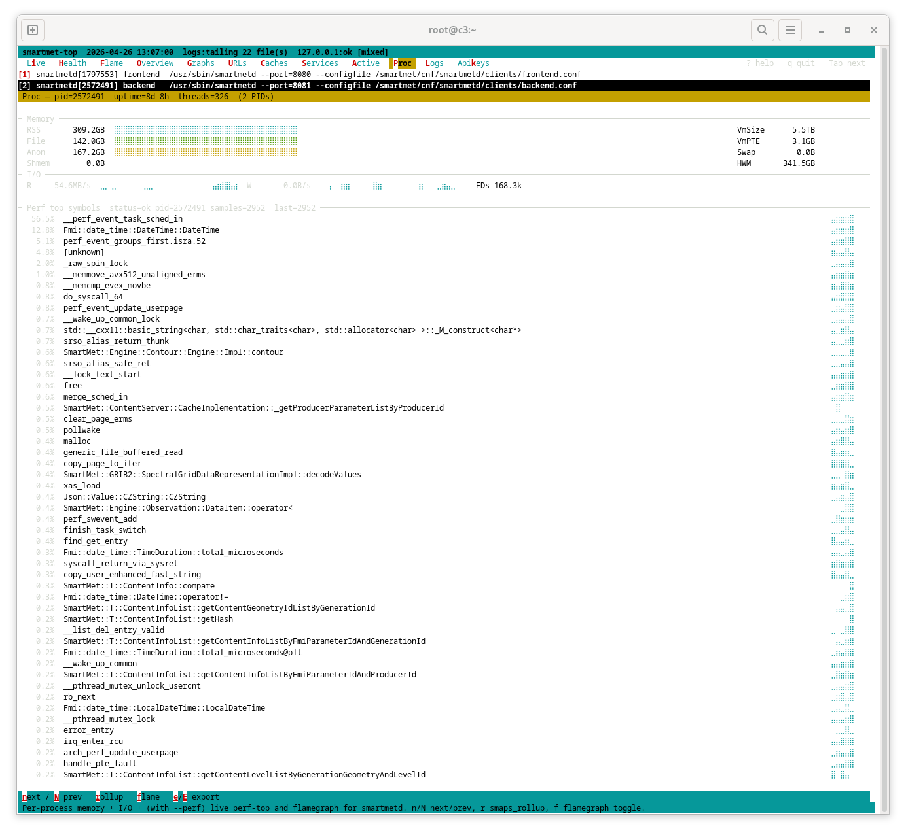

11. **L**ogs — multi-source `tail -F`. Each tailed plugin has its own
    ring buffer; the panel shows a tab bar of plugin names with the
    focused one marked, and ←↑→↓ switch between them. There's also
    an `[all]` virtual entry that pulls from a merged ring across
    every plugin. Enter / End jumps to the live tail; `/` filters
    within the focused source.

    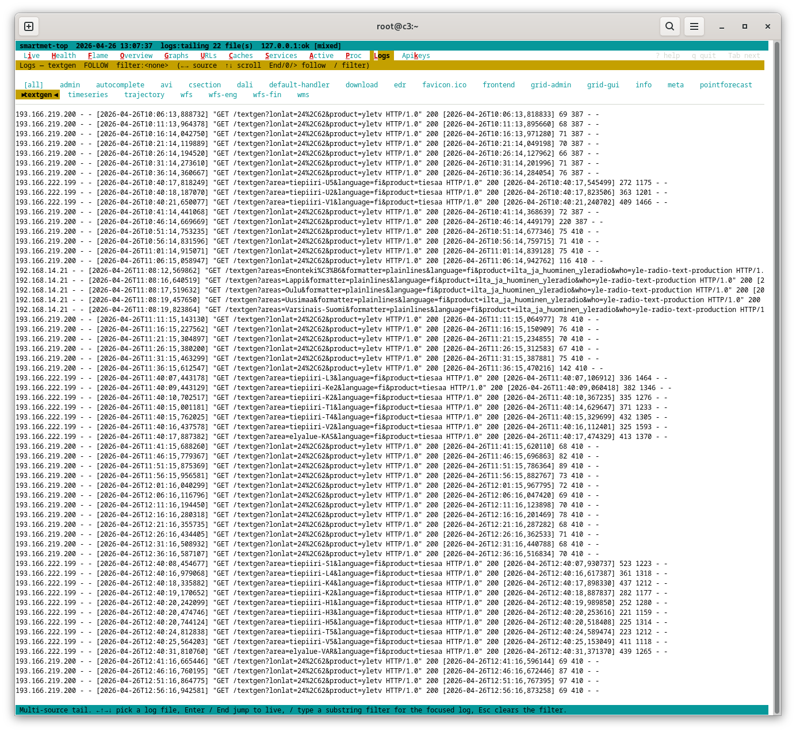

12. Api**k**eys — per-API-key aggregate stats; Enter drills into the
    key to see top URLs it calls.

### Data sources

* **Log tail** — pass one or more `-l PATH` (or glob). Multiple log
  files are tailed concurrently; rotation is detected via inode change.
* **Admin plugin** — pass `-u http://host:8080/admin`. Multiple hosts
  may be configured with repeated `-u` or comma-separated values, and
  each URL can be given a label: `-u prod=http://a/admin,dev=http://b/admin`.
  The panel chrome shows per-host status. Role (frontend/backend/mixed)
  is auto-detected from `?what=list` on startup.

  Smoke-test the admin URL with `wget` or `curl` before pointing
  `smtop` at it — the `?format=json` endpoints are what `smtop`
  polls:

  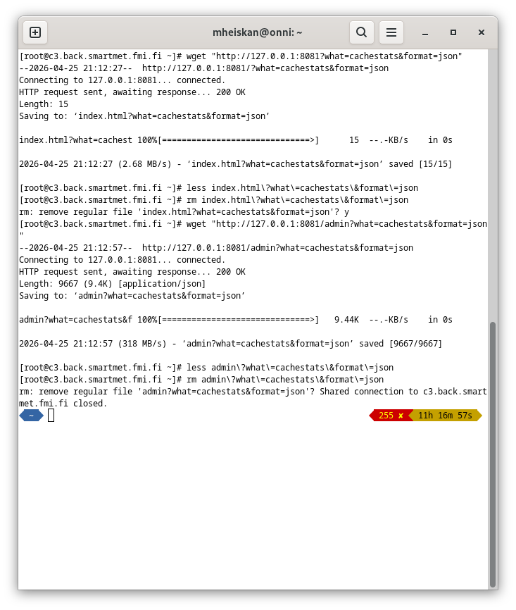

### Key reference (excerpt)

| Key              | Effect                                              |
|------------------|-----------------------------------------------------|
| `i h f o g u c s a p l k` | jump to view / panel by mnemonic letter (highlighted red in tab) |
| `Tab` / `Shift-Tab` | next / previous panel                            |
| `?` / `F1`       | help overlay                                        |
| `↑` `↓` `←` `→` `PgUp` `PgDn` `Home` `End` | cursor and page movement |
| `Enter`          | drill into selected URL / API key                   |
| `↑` / `↓`        | next / prev entry inside a drill-in                 |
| `/`              | filter (URLs / Keys / Logs)                         |
| `s` / `S`        | cycle sort column forward / back (URLs/Keys panels) |
| `r`              | reverse sort, or run `smaps_rollup` (Proc panel)    |
| `[` / `]`        | shrink / grow time window (1 / 5 / 15 / 60 min)     |
| `n` / `N`        | next / prev smartmetd PID (Proc and Flame panels)   |
| `1` – `9`        | select smartmetd PID by index in the selector at the top of Proc / Flame |
| `f`              | toggle inline flamegraph (Proc); also the Flame view mnemonic |
| `↑↓←→` `Enter` `Esc/u` `0` | navigate / zoom in / zoom out / reset (Flame view) |
| `m` / `b` / `i`  | toggle time spark / size spark / idle handlers (Graphs panel) |
| `e` / `E`        | export current panel as CSV / JSON                  |
| `q` / `Ctrl-C`   | quit                                                |

Exports are written to `$SMARTMET_MONITOR_EXPORT_DIR`
(falls back to `$SMARTMET_TOP_EXPORT_DIR`, then `/tmp`). A toast
reports the exact path after write.

### Memory model

* Per-URL stats are kept as one exponential-bin histogram (40 bins,
  base 1.5) per minute, retained for `--history-minutes` (default 60
  minutes). ~20 KB per URL per hour.
* Per-plugin (per-access-log) stats keep 60 1-second buckets plus
  `--history-minutes` 1-minute buckets. ~3 KB per plugin per hour ×
  ~20 plugins ≈ 60 KB per hour. With `--history-minutes 1440` (24 h)
  that's ~17 MB; with `--history-minutes 10080` (7 d) ~120 MB.
* Admin-plugin snapshots retain 300 samples per entity per host
  (≈ 10 minutes at the default 2-second poll cadence).
* Per-PID memory/IO samples retain 1800 ticks (60 min @ 2 s) ≈ 360 KB
  per smartmetd process.

### Replaying historical logs

`--replay` reads the tail of each log file (capped at `--replay-bytes`,
default 1 GB) so the dashboard opens with populated panels rather
than empty ones. Add `--include-rotated` to also read every rotated
sibling (`<base>-YYYYMMDD`, `<base>-YYYYMMDD.gz`) in chronological
order — combined with `--history-minutes 10080` this gives a full
week of context. Compressed `.gz` files are read transparently via
the stdlib `gzip` module; no pip dependency.

## Building the RPM

```sh
make rpm
```

`make rpm` builds a source tarball from `HEAD` and runs `rpmbuild -tb`,
which uses `%_topdir` from `~/.rpmmacros` — the same convention as the
other `smartmet-*` packages in this workspace.

The resulting `smartmet-monitor-<version>-<release>.noarch.rpm` installs
everything under `/usr/bin`, `/usr/share/smartmet`, and the distribution
site-packages directory (e.g. `/usr/lib/python3.9/site-packages/smartmet_top`).
